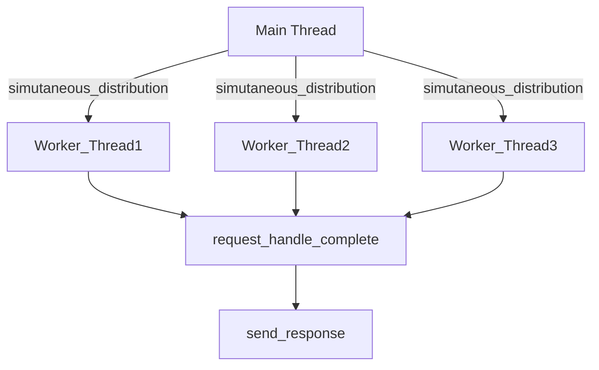
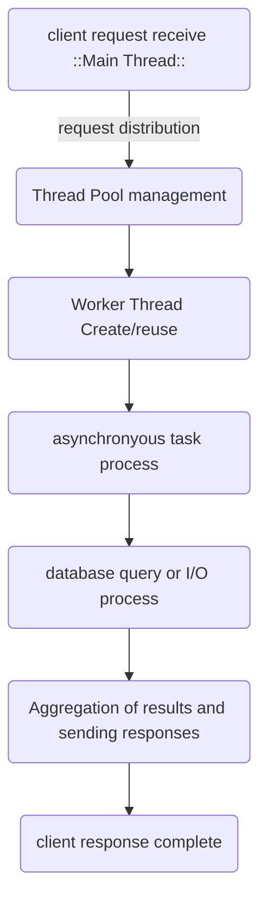

# 멀티 스레딩

### 목차

---

1. 서론
2. 멀티스레딩의 개념과 서버 환경에서의 필요성
3. 성능 향상
4. 응답성 개선
5. 자원 효율성
6. 스레드 관리와 구현 사례
7. 기술적 도전 과제 및 해결 방안
8. 결론 및 주요 시사점

---

## 1. 서론

현재 서버 환경에서는 급증하는 데이터 처리량과 다양한 사용자 요청을 효율적으로 처리하기 위해 멀티스레딩 기술이 중요한 역할을 수행하고 있다. 본글은 서버 환경에서 멀티스레딩의 성능 향상, 응답성 개선 및 자원 효율 측면에서 미치는 영향을 분석하며, 구체적인 사례와 실무에서의 구현 예시, 그리고 관련 기술적 도전 과제에 대해 논의한다. 멀티스레딩은 단일 스레드 방식과 달리 여러 스레드를 동시에 실행함으로써 여러 작업을 병렬 처리할 수 있으며, 특히 I/O 바운드 작업과 네트워크 통신에서 우수한 성능을 발휘한다. 또한, 서버 환경에서는 작업 부하 분산과 자원 재사용, 그리고 빠른 응답 처리가 필수적이므로, 효과적인 스레드 관리 및 동기화 기술이 핵심 과제로 대두된다.

이 글은 멀티스레딩 기술의 기본 개념과 이를 통해 서버 성능이 어떻게 향상되는지, 그리고 응답성과 자원 효율성이 어떻게 개선되는지를 체계적으로 분석한다. 아울러 Java, Pythton, 그리고 SQL 환경에서의 멀티스레딩 구현 사례를 비교 분석하여 실무 적용시 고려해야 하는 점들을 명확하게 제시한다.

---

## 2. 멀티스레딩의 개념과 서버 환경에서의 필요성

### 2.1 멀티스레딩의 정의 및 원리

멀티스레딩은 하나의 프로세스 내에서 여러 개의 스레드를 생성하여 동시에 작업을 실행하는 기법이다. 각 스레드는 동일한 메모리 공간을 공유하면서 독립적으로 실행되기 때문에, 스레드 간 통신 및 데이터 공유가 용이하며, 그 결과 프로세스 전반의 자원 소모를 줄일 수 있다. 이와 반대로, 멀티 프로세싱은 서로 다른 메모리 공간을 사용하는 여러 프로세스를 동시에 실행하는 방식으로, 데이터 보호 측면에서는 우수하나 자원 소모와 생성 오버헤드는 크다는 단점이 있다.

### 2.2 서버 환경에서의 멀티스레딩 필요성

서버는 다수의 사용자 요청을 실시간으로 처리해야 하는 특성상, 단일 스레드 방식으로는 요청이 밀릴 경우 전체 시스템의 응답 속도가 급격히 저하될 위험이 있다. 멀티스레딩 기법을 활용하면 각 사용자 요청을 별도의 스레드로 분배하고, 동시에 병렬로 처리할 수 있어 응답 시간을 크게 단축시킬 수 있다. 예를 들어, 웹 서버는 들어오는 각 클라이언트 요청을 독립적인 스레드에 할당하면, 한 스레드가 블로킹 상태에 빠지더라도 다른 스레드들은 계속해서 요청을 처리하여 서버 전체의 응답성을 유지할 수 있다.

서버 환경에서는 데이터베이스, 쿼리 처리, 파일 전송, 네트워크 통신 등 I/O 바운드 작업이 많이 발생한다. 이러한 작업들은 CPU 사용률은 낮지만, 응답 대기 시간이 길어질 수 있으므로 멀티스레딩을 통해 효율적으로 병렬 처리하는 것이 매우 중요하다.

---

## 3. 성능 향상

서버 환경에서 멀티스레딩이 성능을 향상시키는 주요 요인은 다음과 같다.

### 3.1 병렬 처리 및 작업 분산

멀티스레딩 기술을 활용하면, 서버는 여러 작업을 동시에 처리하여 각 작업의 대기 시간을 최소화 할 수 있다. 예를 들어, 데이터베이스 관리 시스템(DBMS)에서 멀티스레딩은 여러 개의 SQL 쿼리를 동시에 실행할 수 있어, 단일 스레드 방식보다 빠른 쿼리 속도를 제공한다. 이러한 병렬 처리 능력은 서버가 다수의 사용자 요청이나 복잡한 데이터 처리 작업을 동시에 효과적으로 수행하도록 지원한다.

### 3.2 확장성 및 부하 분산

멀티스레딩은 작업 부하가 증가할 경우 추가 스레드를 생성하여 부하를 분산시킬 수 있는 확장성을 제공한다. 클라우드 컴퓨팅 환경에서는 가상화된 서버가 멀티스레딩을 통해 다수의 요청을 병렬로 처리함으로써, 전체적인 자원 활용도를 극대화하고 응답 속도를 향상시킨다.

Tomcat과 같은 웹 서버 환경에서는 스레드 풀을 활용하여 요청 처리에 필요한 스레드 수를 동적으로 조절할 수 있으며, 이를 토해 높은 트래픽 상황에서도 안정적인 성능을 유지할 수 있다.

### 3.3 CPU 및 메모리 자원 효율화

멀티스레딩은 동일한 프로세스 내에서 실행되기 때문에, 메모리 및 기타 시스템 자원을 효율적으로 공유할 수 있다. 단일 프로세스 내 여러 스레드가 메모리 공간을 공유하면, 각 스레드가 별도의 프로세스를 생성할 때 발생하는 오버헤드를 줄일 수 있다. 이는 CPU 코어가 다중 작업을 병렬로 수행할 수 있는 환경에서 특히 유리하며, 자원 소모를 줄여 서버의 전반적인 성능을 개선한다.

| 항목 | 단일 스레드 | 멀티스레드 |
| --- | --- | --- |
| 작업처리 방식 | 순차적 처리  | 병렬 및 동시 처리 |
| 자원 사용 | 별도의 프로세스 생성으로 높은 오버헤드 | 메모리와 자원 공유로 효율적 |
| 응답 시간 | 긴 대기 시간 발생 가능 | 빠른 응답 및 지속적인 서비스 제공 |
| 확장성 | 제한적 확장 | 부하 분산 및 동적 확장 가능 |

---

### 3.4 사례: SQL 데이터베이스에서의 멀티 스레딩

SQL 데이터베이스 관리 시스템에서는 대량의 쿼리를 병렬 처리하여 성능을 최적화하기 위해 멀티스레딩이 중요한 역할을 한다. 데이터베이스 관리자와 개발자는 멀티스레딩을 통해 백업, 데이터 마이그레이션, 복잡한 쿼리 최적화 작업을 동시에 실행할 수 있다. 이를 통해 데이터 처리 속도를 향상시키고, 사용자가 데이터를 보다 빠르게 접근할 수 있도록 한다.

---

## 4. 응답성 개선

서버 환경에서 멀티스레딩은 높은 응답성을 유지하는데 결정적인 역할을 한다. 사용자 경험을 향상시키기 위해 서버가 빠르게 요청을 처리하고 응답하는 것이 매우 중요하다.

### 4.1 비동기 처리와 UI/요청 분리

멀티스레딩을 활용하면, 주 스레드와 별도의 작업 스레드를 분리하여 실행함으로써 사용자 인터페이스(또는 클라이언트 요청)를 빠르게 응답할 수 있다. 예를 들어, Lazarus 기반의 멀팃스레드 애플리케이션에서는 UI 업데이트는 반드시 메인 스레드에서 수행해야 하며, 백그라운드 작업은 별도의 스레드에서 처리함으로써 애플리케이션의 응답성을 유지한다. 이와 같은 구조는 웹 서버에서도 유용하게 적용되며, 메인 요청 처리 스레드는 빠르게 사용자 요청을 받아들이고, 복잡한 처리 작업은 워커 스레드에 위임하여 전체 시스템의 응답성을 높인다.

### 4.2 동기화와 컨텍스트 스위칭

멀티스레딩에서 중요한 기술 중 하나는 동기화(Synchronization)이다. 동기화는 서로 다른 스레드가 공유 자원에 접근할 때 데이터 무결성이 보장되도록 한다. 그러나, 동기화에 따른 추가 오버헤드와 컨텍스트 스위칭은 때때로 성능 저하를 초래할 수 있으므로, 이를 최소화할 수 있는 설계가 필요하다. 예를 들어, Java 기반 웹 서버에서는 스레드 풀을 사용하여 스레드 생성 및 소멸에 따른 비용을 감소시키고, lock을 최소화하여 응답 지연을 줄이는 방법이 사용된다.

### 4.3 사례: 웹 서버에서의 멀티스레딩 응답성

멀티스레딩은 실제 웹 서버 환경에서 다수의 클라이언트 요청을 동시에 처리할 수 있도록 돕는다. 한 예로, Tomcat과 같은 서버는 최대 스레드 수(maxThread)와 최소 유휴 스레드 수(minSpareThreads)를 사용하여 동시 처리되는 요청 수를 제어하며, 이를 통해 높은 트래픽 상황에서도 지속적인 응답성을 유지한다. 이러한 접근 방식은 아래의 플로우 차트와 같이 요청이 들어올 때 메인 스레드가 빠르게 요청을 워커 스레드에 분배하고, 각 스레드가 병렬로 요청을 처리하는 구조로 설명할 수 있다.

*도표 1: 웹 서버 요청 처리 플로우 (멀티스레딩 방식)*

멀티스레딩은 I/O 바운드 작업에서 특히 유용하다. Python의 멀티스레딩 예시에서는, 네트워크나 디스크 I/O 작업이 진행되는 동안 GIL(Global Interepreter Lock) 문제에도 불구하고, 다른 스레드들이 자유롭게 처리될 수 있어 전체 처리 속도를 개선할 수 있다. 이러한 비동기 I/O 모델은 서버가 데이터베이스 요청, 파일 전송, 또는 외부 API 호출과 같은 작업을 동시에 처리할 때 필수적인 요소로 작용한다.

---

## 5. 자원 효율성

서버 환경에서 자원 효율성은 시스템 전반의 비용, 전력 소모, 그리고 유지 관리에 큰 영향을 미친다. 멀티스레딩은 다음과 같은 방식으로 자원 효율을 극대화한다.

### 5.1 스레드 풀과 자원 재사용

멀티스레딩에서는 스레드 풀(thread pool)을 사용하여 스레드 생성과 제거에 드는 비용을 줄일수 있다. 스레드 풀은 요청이 발생할때마다 새 스레드를 생성하는 대신, 미리 생성된 스레드를 재사용함으로써 메모리와 CPU 오버헤드를 절감한다. 

### 5.2 공유 메모리와 자원 최소화

멀티스레딩의 가장 큰 장점 중 하나는 동일한 프로세스 내에서 실행되므로 메모리 공간과 자원을 공유할 수 있다는 점이다. 따라서, 별도의 프로세스를 생성하는 멀티프로세싱에 비해, 시스템 자원 사용 면에서 훨씬 경제적이다. 멀티스레딩은 컨텍스트 스위칭 비용이 낮고, 프로세스 생성 비용이 적어 전반적인 시스템 자원 사용을 최적화 할 수 있다.

### 5.3 컨텍스트 스위칭의 최소화

**멀티스레딩 환경에서 스레드 간의 컨텍스트 스위칭은 비교적 빠르며, 전체 시스템의 응답 속도와 자원 소비에 큰 영향을 미치지 않는다.** 단, 동기화 메커니즘과 락의 사용은 불필요한 컨텍스트 스위칭을 유발할 수 있으므로, 개발자는 이를 신중하게 설계하여 오버헤드를 최소화해야 한다. 이를 위해 Java와 같은 현대적 웹 서버는 고급 동기화 기법과 스레드 풀을 활용하여 최적의 성능을 유지하도록 설계되어 있다.

## 6. 스레드 관리와 구현 사례

---

서버 환경에서 효과적인 멀티스레딩 구현은 적절한 스레드 관리와 동기화 메커니즘에 달려 있다. 여기에서는 주요 구현 사례들과 그에 따른 관리 방법에 대해 살펴본다.

### 6.1 Java 기반 웹 서버의 스레드 관리

Java 서버 환경에서는 Tomcat과 같은 웹 서버가 대표적인 사례이다. Tomcat은 다음과 같은 설정을 통해 스레드를 관리한다.

- maxThreads: 최대 스레드 수를 설정하여 동시 처리 가능한 요청 수를 제한
- minSpareThreads: 유후 상태의 최소 스레드 수를 보장하여, 갑작스런 요청 증가 시 대응력을 높임.

아래는 Tomcat의 스레드 풀 설정을 요약한 표이다.

| **설정 항목** | **설명** | **예시 값** |
| --- | --- | --- |
| maxThreads | 최대 생성 가능한 스레드 수 | 200 |
| minSpareThreads | 대기 상태의 최소 스레드 수 | 4 |

*표 3: Tomcat 스레드 풀 설정 요약6*

### 6.2 Python 멀티스레딩의 활용 사례

Python의 경우, GIL(Global Interpreter Lock)으로 인해 CPU 바운드 작업에서는 멀티스레딩의 장점이 제한적이나, I/O 바운드 작업에서는 효과적이다. 예를 들어, 웹 크롤러나 네트워크 요청 처리 프로그램에서는 대기 시간 동안 다른 스레드가 작업을 수행할 수 있어 전체 처리 속도가 개선된다. 이러한 특성은 서버에서 발생하는 데이터 전송이나 파일 입출력 작업에서 매우 유용하다.

### 6.3 SQL 데이터베이스에서의 멀티스레딩

SQL 서버의 경우, 대량의 쿼리 처리와 백업, 데이터 마이그레이션 등 여러 작업을 동시에 병렬로 처리할 수 있도록 멀티스레딩을 도입한다. 이를 통해 데이터베이스 관련자들은 복잡한 쿼리 처리 속도를 향상시키고, 사용자 경험을개선할 수 있다. DbVisualizer와 같은 도구를 통해 구현된 멀티스레딩 예제는, 대규모 데이터 세트를 병렬 처리함으로써 서버의 확장성을 높이는 중요한 사례로 평가된다.

### 6.4 실무 적용 예시: 웹 서버와 미디어 플레이어

실제 웹 서버에서는 각 클라이언트의 요청을 별도의 스레드에 할당하여 동시에 처리한다. 한편, 미디어 플레이어는 오디오 디코딩, 비디오 프레임 처리, 사용자 입력 등을 각각의 스레드에서 병렬 처리하여 원활한 재생 경험을 제공한다. 이러한 사례들은 멀티스레딩 구현의 유연성과 효율성을 잘 보여주며, 서버 환경에서도 동일한 원리가 적용됨을 알 수 있다.

## 7. 기술적 도전 과제 및 해결 방안

---

멀티스레딩 구현 시 고려해야 할 기술적 측면과 도전 과제는 다음과 같다.

### 7.1 동기화 문제 및 DeadLock

멀티스레딩 환경에서 공유 자원에 접근할 때, 스레드 간 동기화를 올바르게 구현하지 않으면 DeadLock 이나 race condition 같은 문제가 발생할 수 있다. 해결방안으로는 다음과 같은 기술들이 있다.

- **Lock 사용의 최소화**: 불필요한 동기화를 피하고, 락이 필요한 부분만 세밀하게 처리
- **비동기 처리를 통한 분산**: 블로킹 작업은 별도의 스레드에서 처리하여 메인 스레드의 응답성을 유지
- **동기화 객체의 효율적 활용**: Semaphore, Mutex, Monitor 등을 적절히 활용하여 DeadLock 위험을 최소화

### 7.2 컨텍스트 스위칭 오버헤드

멀티스레딩은 스레드 간 전환에 따른 컨텍스트 스위칭 비용이 발생한다. 이 비용은 스레드 수가 과도하게 늘어나면 시스템 성능 저하로 이어질 수 있다. 따라서 스레드 풀과 같이 스레드를 재사용하는 기법을 통해, 불필요한 스레드 생성과 소멸을 줄이는 것이 중요하다.

### 7.3 디버깅과 유지보수의 어려움

복잡한 멀티스레드 환경에서는 디버깅이 어려워질 수 있으며, 특히 동시성 버그를 재현하고 해결하는 과정은 상당한 시간과 노력이 요구된다. 이를 극복하기 위해 다음과 같은 접근이 필요하다.

- 포괄적 로그 기록: 각 스레드의 동작을 기록함으로써 문제 상황을 재현
- 고수준 라이브러리 사용: Java의 java.util.concurreent와 같은 고수준 동시성 라이브러리를 활용하여 저수준 동기화 문제를 추상화
- 테스트 자동화 및 시뮬레이션: 다양한 동시성 시나리오를 테스트하여, 문제가 발생할 가능성이 있는 부분을 사전에 검증

## 8. 결론 및 주요 시사점

---

서버 환경에서 멀티스레딩은 성능 향상, 응답성 개선, 그리고 자원 효율성을 동시에 달성할 수 있는 강력한 기술로 자리 잡았다. 주요 시사점은 다음과 같다.

- **성능 향상:**
    - 병렬 처리를 통해 다수의 작업을 동시에 실행하며, 데이터베이스 쿼리나 I/O 바운드 작업의 처리 속도를 크게 개선한다3.
    - 확장성과 부하 분산이 용이하여, 고트래픽 상황에서도 안정적인 성능을 유지할 수 있다2.
- **응답성 개선:**
    - 메인 스레드와 워커 스레드를 분리하여, UI 또는 클라이언트 요청에 빠르게 응답할 수 있도록 한다12.
    - 동기화 및 비동기 I/O를 적절히 사용하여, 블로킹 상황에서도 지속적인 서비스 제공이 가능하다5.
- **자원 효율성:**
    - 스레드 풀을 통한 자원 재사용과 공유 메모리 모델로, 별도 프로세스 생성에 따른 오버헤드를 크게 줄인다410.
    - 컨텍스트 스위칭 최소화 및 효율적 자원 관리를 통해, 전반적인 시스템 효율성을 극대화할 수 있다16.

아래는 위의 주요 시사점을 정리한 표이다.

| **주요 시사점** | **설명** |
| --- | --- |
| 성능 향상 | 병렬 처리와 확장성을 통해 데이터 처리 속도 및 처리량 개선 |
| 응답성 개선 | 메인 스레드와 워커 스레드 분리로 빠른 요청 처리 및 UI 응답성 보장 |
| 자원 효율성 | 스레드 풀과 공유 메모리 활용으로 생성 오버헤드 감소 및 효율적 운영 |

*표 4: 서버 환경에서 멀티스레딩의 주요 시사점 요약410*

또한, 실무 구현 사례에서 나타난 바와 같이, Java의 Tomcat, Python의 I/O 처리, SQL 데이터베이스의 병렬 쿼리 처리 등 다양한 예시들이 멀티스레딩의 실제 효과를 입증하고 있다. 이러한 사례들은 멀티스레딩이 단순한 성능 개선을 넘어서, 서버의 안정성과 자원 관리 측면에서도 핵심 역할을 수행함을 보여준다.

## **종합 정리**

---

멀티스레딩은 서버 환경에서 높은 성능과 뛰어난 응답성을 달성하기 위한 핵심 기술이다. 본 연구에서는 멀티스레딩의 이론적 배경과 서버 환경에서의 구체적 구현, 그리고 실제 사례들을 통해 다음과 같은 결론을 도출할 수 있다.

- **병렬 처리와 확장성:**
    
    멀티스레딩을 통해 서버는 다수의 요청을 동시에 처리할 수 있으며, 부하 분산과 동적 확장이 가능하다. 이러한 특성은 데이터베이스 쿼리 처리, 웹 서버 요청 처리, 파일 전송 등 다양한 응용 분야에서 큰 성능 향상을 가져온다23.
    
- **높은 응답성 유지:**
    
    요청을 별도의 워커 스레드에 할당함으로써, 메인 스레드는 지속적으로 사용자 요청을 받아들이며 빠른 응답을 제공할 수 있다. 이로 인해 사용자 경험이 크게 개선된다1.
    
- **자원 재사용과 효율성 극대화:**
    
    스레드 풀과 공유 메모리 구조를 활용하여, 프로세스 생성에 따른 오버헤드를 최소화하고 시스템 자원을 효율적으로 사용할 수 있다4610.
    
- **기술적 도전과제의 해결:**
    
    동기화 문제, 데드락, 컨텍스트 스위칭 오버헤드 등 멀티스레딩 환경 특유의 기술적 도전 과제는, 고수준 동시성 라이브러리 및 효과적인 테스트와 로깅을 통해 해결할 수 있다.
    

---

## **결론**

서버 환경에서 멀티스레딩은 다음과 같은 주요 이점을 제공한다.

- **성능 및 효율성 향상:** 병렬 처리와 자원 재사용을 통해 빠른 처리 속도와 높은 확장성을 보장한다.
- **응답성 개선:** 메인 스레드와 워커 스레드의 분리를 통해 사용자 요청에 대해 지연 없이 빠른 응답을 제공한다.
- **자원 관리 최적화:** 스레드 풀과 공유 메모리 구조를 활용해, 프로세스 생성 및 컨텍스트 스위칭 비용을 절감하며 시스템 전체의 자원 사용 효율을 극대화한다.
- **실무 구현 사례의 다양성:** Java, Python, SQL 등의 다양한 플랫폼에서 멀티스레딩 기술이 성공적으로 적용되어 효과를 입증하고 있다.
- **기술적 도전 과제 해결:** 동기화, 데드락 그리고 컨텍스트 스위칭과 같은 문제들을 적절한 기법과 라이브러리 사용을 통해 관리할 수 있다.

**주요 발견사항 요약**

- 병렬 처리 및 확장성 향상을 통해 서버 성능이 크게 개선됨
- 빠른 응답 시간 제공으로 사용자 경험이 향상됨
- 스레드 관리 및 자원 재사용 전략으로 시스템 효율성이 극대화됨
- 기술적 동시성 문제는 효과적인 동기화 기법과 스레드 풀 구성으로 해결 가능함

서버의 효율성과 성능을 향상시키기 위해, 멀티스레딩은 앞으로도 지속적으로 발전하고 적용되어야 할 핵심 기술이다. 관련 개발자와 관리자들은 최신 동시성 라이브러리와 테스트 기법을 도입하여, 멀티스레딩 환경에서 발생할 수 있는 문제들을 사전에 예방하고 최적의 성능을 달성해야 할 것이다.
