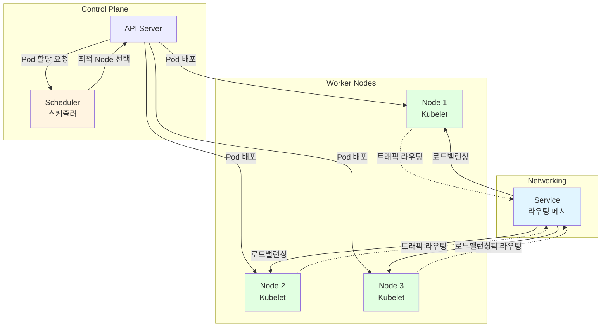

글 내용: 유닉스.리눅스 시스템 관리 핸드북(25장 컨테이너) 

## 컨테이너
컨테이너 분야에서는 최근 수년간 마법처럼 보이는 몇 가지 기술이 개발됐습니다. 이는 2013년 오픈소스 Docker 프로젝트의 발표와 함께 유명세가 폭발했습니다. 컨테이너는 특히 시스템 관리자에게 흥미롭습니다. 이는 오랫동안 손보지 못했던 소프트웨어 패키징을 표준화하기 때문입니다.

컨테이너의 활용성을 알아보고자 현대적인 언어와 프레임워크로 개발된 전통적인 웹 어플리케이션을 살펴봅시다. 해당 애플리케이션을 설치하고 구동하고자 최소한 다음과 같은 사항이 포함되어야 합니다.

- 애플리케이션 코드와 그 환경설정이 올바르게 되어있다.
- 십수개에 해당하는 라이브러리 및 기타 의존성 관련 사항, 각각은 호환성 때문에 특정 버전에 관련이 있습니다.
- 코드를 실행하기 위한 인터프리터 떠는 런타임, 또한 버전이 지정되어 있습니다.
- 사용자 계정, 환경 설정, 운영체제가 제공하는 서비스 같은 Localization

전통적인 사이트는 이런 애플리케이션을 수십, 수백개 실행합니다. 다수의 애플리케이션 배포 간에 이러한 영역 각각을 균일하게 유지보수하는 것은 항상 도전적입니다. 별도의 애플리케이션에서 필요한 호환되지 않는 의존성은 그들을 공유 불가능하게 하기 때문에 시스템의 활용도가 떨어지게 만듭니다. 추가로, 소프트웨어 개발자와 시스템 관리자가 기능적으로 분리된 사이트에서는 운영환경의 어떤 부분을 누가 책임지고 있는지 식별하기가 직관적이지 않은 경우가 있으므로 주의 깊게 협업해야 합니다.

컨테이너 이미지는 애플리케이션과 사전에 필요한 부분들을 표준화하고 휴대성 있는 파일로 패키징하기 때문에 이를 단순화할 수 있습니다. 호환성 있는 컨테이너 런타임 엔진을 갖는 모든 호스트는 이미지를 템플릿으로 사용해서 컨테이너를 생성할 수 있습니다. 수십, 수백개의 컨테이너가 충돌 없이 동시에 실행될 수 있습니다. 수백 메가 크기 이하의 이미지는 시스템간의 복사도 할 수 있습니다. 이러한 높은 애플리케이션 휴대성은 컨테이너가 각광받게 된 가장 큰 이유입니다.

도커 이전의 초기 사업은 컨테이너를 주요 사용처로 가져오는 허브 역할을 했습니다. 그리고 우리는 시스템 관리자로써 Docker에 맞닥뜨릴 확률이 높습니다. Docker.Inc.는 컨테이너와 관련된 여러 제품을 제공합니다. 하지만 이 책에서는 주 컨테이너 엔진과 swarm 클러스터 관리자로 논의를 제한할 것입니다.

다른 여러 컨테이너 엔진또한 있습니다. 센트 OS와 rkt가 가장 완전합니다. 이는 도커보다 더 명료한 처리 모델과 더 강한 기본 보안 환경설정을 갖고 있습니다. rkt는 쿠버네티스 오케스트레이션 시스템과 잘 통합됩니다. systemd 프로젝트의 systemd-nspawn는 경량 컨테이너를 위한 또 다른 대체제입니다. 이는 도커나 rkt 보다는 적은 기능을 갖고 있지만 어떤 경우에서는 좋은 성택일 수 있습니다. rkt는 컨테이너 네임스페이스를 설정하고자 systemd-nspawn을 활용합니다.

### 기본과 핵심 개념
컨테이너의 빠른 증가는 단일 기술의 출현보다는 타이밍에 기인한 면이 있습니다. 컨테이너는 다양한 현존 커널, 파일 시스템, 네트워크 기술을 융합한 것입니다. 컨테이너 엔진은 이 모든것을 함께 관리하는 소프트웨어 입니다.

간략하게 컨테이너는 별도의 루트 파일 시스템과 프로세스 네임스페이스를 구분하는 고립된 프로세스들의 집합입니다. 컨테이너화된 프로세스는 호스트 OS의 커널과 기타 서비스를 공유하지만 기본적으로 컨테이너 밖의 파일이나 시스템 자원에 접근할 수는 없습니다. 컨테이너 내에서 동작하는 애플리케이션은 그들이 컨테이너화되어 있다는 상태를 알지 못하고 그에 따라 수정이 필요치 않습니다.

다음의 절들을 읽고 나면 컨테이너가 더 이상 마법과 같다고 생각하지 않을것입니다. 사실 이들은 수년동안 있어왔던 유닉스와 리눅스의 특정 기능에 의존합니다.

### 커널 지원
컨테이너 엔진은 프로세스를 고립시키기 위한 여러 커널 기능을 사용합니다.
- *네임스페이스*: 네임스페이스는 다양한 운영체제 기반 구조에서 컨테이너화된 프로세스를 고립시킵니다. 이러한 기반 구조에는 파일 시스템 마운트, 프로세스 관리, 네트워킹 등이 포함됩니다. 예를 들어 마운트 네임스페이스는 프로세스에 파일 시스템 계층을 커스텀화된 방식으로 보여줍니다. 컨테이너는 이러한 네임스페이스가 어떻게 설정되어 있는지에 따라 호스트 운영체제와 다양한 통합 수준을 갖고 실행합니다.

- *컨트롤 그룹(cgroup)*: 컨트롤 그룹은 특정 프로세스에서 사용하는 시스템 자원과 우선순위를 제한합니다. cgroup은 사용 가능한 CPU와 메모리를 모두 소비하는 것을 막습니다.

- *자격(Capability)*: 이는 프로세스가 특정 민감한 커널 동작과 시스템 콜을 수행할 수 있게 합니다. 예를 들어 프로세스가 파일의 소유권을 변경하도록 허용하거나 시스템 시간을 설정하도록 능력을 부여할 수 있습니다.

- *보안 컴퓨팅 모드(seccomp)*: 이는 System Call로의 접근을 제한합니다. 이는 허용보다 더 섬세한 제어를 가능하게 합니다.

이러한 기능의 개발은 리눅스 컨테이너 프로젝트 LXC의 일부로 진행됐습니다. 이는 2006년에 구글에서 시작된 프로젝트로, LXC는 구글의 내부 가상화 플랫폼인 Bong을 기반으로 합니다. LXC는 리눅스 컨테이너를 생성하고 구동하는데 필요한 원시 기능과 도구를 지원합니다. 그러나 30개가 넘는 커맨드라인 도구와 환경설정 파일이 존재합니다. 도커의 초기 릴리스는 LXC를 사용하기 쉽게 만든 래퍼였습니다.

도커는 이제 발전되고 표준기반 컨테이너 런타임을 맡고 있는 containerd에 의존합니다. 이 역시 컨테이너 고립에 리눅스 네임스페이스, cgroup, 자격 에 의존합니다.

### 이미지
컨테이너 이미지는 컨테이너를 위한 템플릿이 될 수 있습니다. 이미지는 그 성능과 휴대성을 위해 Union File System에 의존합니다. Union은 단일, 일관된 계층을 생성하고자 여러 File System에 중첩합니다. 컨테이너 이미지는 전통적인 리눅스 배포판에서의 루트 파일 시스템과 유사하게 조직돼 있는 Union File System 입니다. 디렉토리 구조와 바이너리, 라이브러리, 지원되는 파일의 위치는 모두 표준 리눅스 파일 시스템 계층 명세서를 따릅니다. 컨테이너 이미지의 기본으로 사용하기 위한 특수한 리눅스 배포판도 개발됐습니다.

컨테이너를 생성하고자 도커는 이미지의 읽기 전용 유니온 파일 시스템을 가리키고 컨테이너가 갱신할 수 있게 하는 읽기/쓰기 계층을 추가합니다. *컨테이너화된 프로세스*가 파일 시스템을 수정하면 그 변경점은 읽기/쓰기 계층에 투명하게 저장됩니다. 기본 이미지는 수정되지 않은 상태로 남아있습니다. 이는 쓰기시 복제 전략이라 합니다. 

여러 컨테이너가 같은 불변의 기본 레이어를 공유할 수 있습니다. 따라서 스토리지 효율성이 증가하고 시작 시간이 줄어듭니다. 


[기본 이미지와 통합 파일 시스템1]


[기본 이미지와 통합 파일 시스템2]

### 네트워킹
네트워크에 컨테이너를 접속하게 하는 기본 방식은 호스트의 네트워크 네임스페이스와 브리지를 사용하는 것입니다. 이 설정에서 컨테이너는 호스트의 밖에서는 접근이 불가능한 사설 IP 주소를 갖습니다. 호스트는 IP 라우터처럼 동작하고 트래픽을 밖과 컨테이너 간에 전달합니다. 이러한 아키텍쳐는 관리자에게 어떤 컨테이너 포트를 바깥 세계로 열지 결정할 수 있게 합니다.

물론 사설 컨테이너 주소 방식을 포기하고 전체 컨테이너를 직접 네트워크에 연결할수도 있습니다. 이는 호스트 모드 네트워킹이라고 불리고 컨테이너가 호스트의 네트워크 스택에 자유로운 접근이 가능하다는 것을 말합니다. 이는 어떤 상황에서는 바람직하지만 컨테이너가 완전히 독립되어 있지 않기 때문에 보안상 위험이 있습니다. 

### 도커: 오픈소스 컨테이너 엔진
Docker.Inc.의 주 제품은 컨테이너를 만들고 관리하는 클라이언트/서버 애플리케이션입니다. 도커 컨테이너 엔진은 Go로 작성되어 있으며 높은 수준으로 모듈러화돼 있습니다. 분리된 개별 프로젝트들은 탈부착 가능한 스토리지, 네트워킹, 기타 기능을 관리하기 위한 것입니다.

Docker.Inc.에 문제가 없지는 않습니다. 그들의 도구가 너무 빠르게 진화하고 있고 새 버전이 현재의 배포 버전과 때로는 호환되지 않기 때문입니다. 일부 사이트는 도커의 생태계에 의지하는것이 해당 벤더에 묶이게 되는것을 걱정합니다. 그리고 다른 새 기술처럼 컨테이너는 복잡성을 만들어내고 이해를 위한 학습을 요구합니다.

이러한 문제를 해결하고자 Docker.Inc.는 오픈 컨테이너 이니셔티브의 일원이 되었습니다. 이는 표준과 협업을 증진하는 건강한 방향의 경쟁을 통해 컨테이너 기술의 향상을 가져오는 것을 목표로 하는 협회입니다. 2017년에 도커는 모비 프로젝트를 시작하고 주 도커 깃 저장소를 해당 프로젝트에 기여해 도커 실행 엔진을 커뮤니티에서 쉽게 개발할 수 있게 합니다.

### 기본 구조
docker는 실행 명령으로, 도커 시스템을 관리하는 모든 작업을 처리합니다. *dockerd는 상주하는 데몬 프로세스로, 컨테이너와 이미지 동작을 구현하는 프로세스*입니다. docker는 *dockerd*와 같은 시스템에서 실행할 수 있고 유닉스 도메인 소켓을 통해 통신하거나 원격 호스트에서 TCP를 통해 dockerd에 접근할 수 있습니다. *dockerd*는 컨테이너를 실행하고자 필요한 모든 기반 요소를 갖고 있습니다. 이는 컨테이너와 이미지가 저장된(기본값 /var/lib/docker) 데이터 디렉토리를 유지 관리하거나 가상 네트워크 연결을 생성합니다. 이는 적절한 시스템 콜 호출, 유니온 파일 시스템 설정, 프로세스 실행을 통해 컨테이너를 생성하게 됩니다. 즉, 컨테이너와 관련된 모든 요청(빌드, 실행)을 처리합니다. 도커의 기본 CLI 클라이언트는 UNIX 소켓 혹은 네트워크 인터페이스를 통해 도커 데몬으로 REST API 요청을 보냅니다.


[도커 아키텍쳐]

docker 클라이언트의 하위 명령을 커맨드라인에서 실행하면 dockerd로 명령을 내릴 수 있습니다. 예를 들어 *docker run* 명령을 통해 컨테이너를 실행할 수 있고, *docker info*를 통해 서버에 대한 정보를 볼 수 있습니다. 

이미지는 컨테이너를 위한 템플릿입니다. 여기에는 컨테이너 인스턴스에서 구동되는 프로세스가 의존하고 있는 라이브러리, 운영체제 바이너리, 애플리케이션 등의 파일을 포함합니다. 리눅스 배포판은 간편한 기본 이미지로 사용할 수 있습니다. 이들이 완전한 운영체제 환경을 갖고 있기 때문입니다. 그러나 이미지가 리눅스 배포판에 기반을 둬야만 하는 것은 아닙니다. 스크래치 이미지는 좀 더 현실적인 이미지의 생성을 위한 기본 이미지를 의도하는 명시적으로 비어있는 이미지입니다.

컨테이너는 실행의 기반으로 이미지 템플릿에 의존적입니다. *dockerd*가 컨테이너를 실행할 때 본래의 이미지에서 분리된 쓰기 가능한 파일 시스템 계층을 생성합니다. 컨테이너는 해당 이미지의 모든 파일과 기타 메타데이터를 읽을 수 있지만 모든 쓰기는 고유의 읽기/쓰기 계층으로 제한합니다.

이미지 레지스트리는 중앙화된 이미지 모음입니다. *docker pull*을 했는데, 이미지가 아직 없는 경우 또는 *docker push*를 해 고유의 이미지를 올린 경우 *dockerd*와 레지스트리가 통신합니다. 기본 레지스트리는 도커 허브입니다. 이는 여러 유명한 애플리케이션용 이미지를 저장하고 있습니다. 대부분의 표준 리눅스 배포판들 역시 도커 이미지를 게재하고 있습니다.

| 하위 명령 | 작업 |
|-----------|-----------|
| docker info | 데몬에 대한 요약 정보 표시  |
| docker ps  | 실행 중인 컨테이너 표시  |
| docker version  | 서버와 클라이언트에 대한 포괄적인 버전 정보 표시  |
| docker rm  | 컨테이너 삭제  |
| docker rmi  | 이미지 삭제  |
| docker images  | 로컬 이미지 표시  |
| docker inspect  | 컨테이너 환경설정 표시(JSON 형식)  |
| docker logs  | 컨테이너에서 표준 출력 표시  |
| docker exec  | 기존 컨테이너에서 명령 실행  |
| docker run  | 새 컨테이너 실행  |
| docker pull/push | 원격 저장소에서 이미지 다운로드 또는 이미지 업로드 |
| docker start/stop  | 기존 컨테이너 시작 또는 정지 |
| docker top | 컨테이너화된 프로세스 상태 표시  |

고유의 레지스트리도 운용하거나 커스텀 이미지를 도커 허브에서 호스팅하는 개인 레지스트리에 추가할 수 있습니다. 레지스트리가 네트워크를 통해 접근이 가능하다면 도커를 사용하는 모든 시스템은 이미지를 받을 수 있습니다.

### 설치
도커는 리눅스, 맥 OS, 윈도우, FreeBSD에서 동작합니다. 그러나 리눅스에서 가장 잘 동작합니다. FreeBSD 지원은 실험적입니다. 

도커 그룹의 사용자는 사용자에게 적절히 루트 권한을 주며 소켓을 통해 도커 데몬을 제어합니다. 이는 현격한 보안 위험입니다. 따라서 도커 그룹에서 사용자를 추가 하기보다는 docker 접근을 제어하고자 sudo를 사용할 것을 권합니다. 다음 예제에서는 루트 사용자로 docker 명령을 수행합니다.

설치 프로세스는 데몬을 바로 시작하지는 않을 수 있습니다. 구동 중이 아니라면 시스템의 일반적인 init 시스템을 통해 시작하세요. 예를 들어 Cent OS의 경우 **sudo systectl start docker**를 수행합니다.

### 클라이언트 설정
로컬 *dockerd*에 접속하고 도커 그룹이나 Sudo 권한을 갖고 있다면 클라이언트 설정은 필요하지 않습니다. docker 클라이언트는 기본적으로 로컬 소켓을 통해 dockerd에 접속합니다. 환경변수를 설정함으로써 이러한 기본 클라이언트 동작을 변경할 수 있습니다. 원격 dockerd에 접속하려면 *DOCKER HOST* 환경변수를 설정합니다. 보통 데몬을 위한 HTTP 포트는 2375, TLS 버전은 2376입니다.

예를 들어 다음과 같습니다
```shell
$ export DOCKER_HOST=tcp://10.0.0.10:2376
```

이는 항상 TLS를 사용해서 원격 데몬에 통신합니다. 일반 HTTP를 사용 한다면 네트워크에 있는 모두에게 루트 권한을 넘겨주는 것이나 다름없습니다.
또한 콘텐트 신뢰를 활성화할 것을 권합니다.

```shell
export DOCKER_CONNECT_TRUST=1
```

이 기능은 도커 이미지의 무결성과 제공자를 검증합니다. 콘텐트 신뢰를 활성화하면 신뢰하지 않는 이미지를 클라이언트가 받는 것을 막습니다.

sudo를 통해 docker를 실행한다면 -E 플래그를 이용해 sudo가 환경변수를 제거하는 것을 막을 수 있습니다. 또한 지정하고 싶은 특정 환경변수를 /etc/sudoers에 *env_keep* 변수를 설정함으로써 유지할 수 있습니다. 

예를 들면 다음과 같습니다

```shell
Defaults env_keep += "DOCKER_CONTENT_TRUST"
```

### 컨테이너 예제
컨테이너를 생성하고자 템플릿으로 사용할 이미지가 필요합니다. 이 이미지는 프로그램을 실행하는 데 필요한 모든 파일을 포함합니다. 새로 설치된 도커에는 이미지가 없습니다. 도커 허브에서 이미지를 다운로드하려면 docker pul을 사용합니다.

```shell
# docker pull debian
Using default tag: latest 
latest: Pulling from library/debian 
f50f9524513f: Download complete 
d8bd0657b25f: Download complete
Digest: sha256:7d38b3517548a1c7141bffe9c8a6d6...
Status: Downloaded newer image for debian: latest
```

16진수 문자열은 유니온 파일 시스템 계층입니다. 하나의 이미지에 하나 이상의 같은 계층이 사용된다면 도커는 하나의 복제본만 필요로 합니다. 여기서는 데비안이 이미지의 특징 태그 또는 버전을 요청하지 않았습니다.

따라서 도키는 latest images로 로컬에서 사용할 수 있는 이미지를 확인합니다.

```shell
# docker images

REPOSITORY          TAG       IMAGE_ID        CREATED         SIZE
ubuntu              latest    ba6acccedd29    2 weeks ago     187.9 MB
ubuntu              wily      ba6acccedd29    2 weeks ago     196.6 MB
ubuntu              trusty    9754318d46af    5 days ago      187.9 MB
ubuntu              trusty    9754318d46af    5 days ago      193.5 MB
centos              latest    d0f34db40850    8 weeks ago     196.6 MB
centos              7         d0f34db40850    2 weeks ago     196.6 MB
debian              latest    f5bf924513f5    2 weeks ago     125.1 MB
debian              jessie    f5bf924513f5    3 weeks ago     125.1 MB
```


이 머신은 여러 리눅스 배포판용 이미지를 가진다. 여기에 방금 다운로드한 데비안 이미지를 볼 수 있습니다. 같은 이미지가 한 번 이상 태그된 것이 보입니다. debian: jessie와 debian:latest는 이미지 ID를 공유하는 것을 확인합니다. 이는 같은 이미지가 다른 두 이름을 갖는다는 것을 의미합니다.

이미지로 기본 컨테이너를 매우 간단히 실행해보자.

```shell
# docker run debian /bin/echo "Hello World"

Hello World
```
동작을 살펴봅시다. 도커는 데비안 기본 이미지에서 컨테이너를 실행하고, 
/bin/echo "Hello Morld" 명령을 그 안에서 실행했습니다. 컨테이너는 해당 명령이 종료되면 수행을 즉시 멈춥니다. 이 경우에는 echo가 완료되는 즉시 멈춥니다. dehian 이미지가 로컬에 이미 존재하지 않는다면 데몬은 명령 실행 전에 자동으로 이를 다운로드 할것입니다. 여기서 태그를 지정하지 않았으므로 기본적으로 latest 이미지를 사용합니다.


*docker run*에 -i와 -t 플래그를 붙이면 셀을 통해 상호작용할 수 있습니다. 다음 명령은 컨테이너 내의 bash 센을 실행하고 컨테이너 밖 셀의 I/O와 이를 연결합니다. 또한 로그에서 식별하는데 도움이 되도록 컨테이너 호스트명을 활당합니다.(그렇지 않 으면 컨테이너의 임의의 ID를 로그 메시지에서 볼 것입니다).

```shell
root@host:~# sudo docker run --hostname debian -it debian /bin/bash

root@debian:/# ls
bin  dev  etc  home  lib  lib64  media  mnt  opt  proc  root  run  sbin  srv  sys  tmp  usr  var

root@debian:/# uname -r
3.10.0-327.10.1.el7.x86_64

root@debian:/# hostname
debian

root@debian:/# ps aux
USER    PID  %CPU  %MEM    VSZ   RSS  TTY   STAT  START  TIME  COMMAND
root      1   0.5   0.0  20236  2026  ?     Ss   19:02  0:00  /bin/bash
root      7   0.0   0.2  17492  1142  ?     R+   19:02  0:00  ps aux

root@debian:/# exit
exit

root@host:~#
```

앞의 절차는 가상 머신에 접속하는 것과 매우 비슷합니다. 여기에는 완전한 루트 파일 시스템이 있지만 프로세스 트리는 거의 비어 있습니다. /bin/bash는 PID 1입니다. 컨테이너 내에서 도커가 실행한 명령이기 때문입니다.

*uname-r*의 결과는 컨테이너의 안팎에서 같은 결과를 보여줍니다. 이는 커널이 공유 되고 있음을 보여준다고 할 수 있습니다.
컨테이너의 프로세스들은 시스템에서 돌아가는 다른 프로세스를 볼 수 없습니다. 그 것은 PID 네임스페이스 때문입니다. 그러나 호스트의 프로세스는 컨테이너화된 프로세스를 볼 수 있다. 컨테이너 내에서 볼 수 있는 프로세스의 PID는 호스트에서 보이는 PID와는 그 값이 다릅니다.

실제 업무 상황에서는 백그라운드에서 오랫동안 돌아가며 네트워크를 통해 연결을 받는 컨테이너가 필요합니다. 다음 명령은 백그라운드(-d)에서 돌아가며 공식 NGINX 이미지에서 생성되는 nginx라 명명된 컨테이너를 구동합니다. 호스트에서 포트 80을 컨테이너 내의 같은 포트로 터널링 합니다.

```shell
root@host:~# docker run --hostname nginx-d nginx:latest locally

Unable to find image 'nginx:latest' locally
latest: Pulling from library/nginx
fd5578x7633: Already exists
a3ed95caeb02: Pull complete 
e04488adab39: Pull complete 
2af76486f8b8: Pull complete
Digest: sha256:a234ab64f6893b9a13811f2c81b46Cfac885cb141dcf4e275ed3
ca18492ab4e4
Status: Downloaded newer image for nginx:latest
Occ36b0e61b5a8211432acf198c39f7b1df864a8132a2e696df55ed927d42c1d

```
nginx 이미지는 로컬에 없습니다. 따라서 도커는 이를 레지스트리에서 가져와야 합니다. 이미지를 다운로드하고 나면 도커는 컨테이너를 시작하고 그 ID를 표시합니다. ID는 고유한 65글자 16진수 문자열입니다.
*docker ps* 는 구동 중인 컨테이너의 간략한 요약을 보여준다.

```shell
# docker ps
IMAGE   COMMAND   STATUS  PORTS                          
nginx    "nginx -g 'daemon off"  Up 2 minutes   0.0.0.0:80->80/tcp
```

우리는 docker에게 컨테이너 내에서 무엇을 구동하라고 말하지 않았다. 따라서 이미지가 생성될 때 지정된 기본 명령을 사용합니다. 위 결과는 그것이 nginx -g 'daemon off'라는 것을 알려줍니다. 이 명령은 nginx를 백그라운드 데몬 대신 포어그라운드로 실행하라는 것을 말합니다. 컨테이너는 프로세스를 관리하기 위한 init 를 갖지 않습니다. 그리고 nginx 서버가 데몬으로 시작되면 컨테이너는 이를 구동하지만 nginx 프로세스를 fork해 백그라운드에 진입하고자 본 프로세스를 종료 하는 즉시 컨테이너를 종료할 것입니다.

대부분의 서버 데몬은 커맨드라인 플래그를 통해 그 실행을 포어그라운드에서 할 수 있게 하는 플래그를 제공합니다. 여러분의 소프트웨어가 포어그라운드에서 실행되지 않거나 한 컨테이너 내에서 여러 프로세스를 실행해야 한다면 컨테이너를 위해 경량 *init* 처럼 동작하는 *supervisord* 같은 프로세스 제어 시스템을 할당할 수 있습니다.

컨테이너 내에서 동작하는 NGINX와 호스트에서 매핑된 포트 80를 이용하면 curl을 이용해 컨테이너로의 HTTP 요청을 만들 수 있습니다. NGINX 서버는 기본 HTML 환영 페이지를 제공합니다.

```shell
host$ curl localhost

‹!DOCTYPE html>
<html>
shead>
‹title›Welcome to nginx!</title>
...
```

*docker logs*를 사용하면 컨테이너의 *STDOUT*을 볼 수 있습니다. 이 경우에서는 NGINX 접근 로그입니다. 트래픽은 위에서 수행한 curL 요청뿐입니다.

```shell
# docker logs nginx
172.17.0.1 - - [24/Feb/2017:19:12:24 +0000]
"GET / HTTP/1.1" 200
612 "_" "cur1/7.29.0" "-"
```

컨테이너 출력을 실시간으로 보고 싶다면 *docker logs -f*를 사용할 수 있습니다. 계속 내용이 늘어나는 로그 파일에서 tail -f를 사용하는 것처럼 말입니다.

*docker exec*는 기존 컨테이너에 새 프로세스를 생성합니다. 예를 들어 디버그나 문제 해결을 위해 컨테이너에 상호작용을 위한 셸을 시작할 수 있습니다.

```shell
# docker exec -ti nginx bash
root@nginx:/# apt-get update && apt-get -y install procps 
root@nginx:/# ps ax
    PID   TTY     STAT     TIME    COMMAND
     1    ?       Ss       0:00    nginx: master process nginx -g daemon off; 
     7    ?       S        0:00    nginx: worker process
     8   ?        Ss       0:00    bash
     21  ?        R+       0:00    ps ax
```

컨테이너 이미지는 가능한 한 가벼워야 합니다. 그래서 일반적인 관리 유틸리티가 없습니다. 따라서 먼저 패키지 인덱스를 갱신하고 *procps* 패키지의 일부인 ps를 설치 합니다.

이 프로세스 목록은 *nginx* 마스터 데몬, *nginx* 워커, 접속해 있는 bash 셀을 나타냅니다. *docker exec*로 생성된 셀을 종료하면 컨테이너는 계속 실행됩니다. 셸이 살아 있는 동안 PID 1이 종료되면 컨테이너는 종료되고 셸 역시 종료될 것입니다.

다음과 같이 컨테이너를 시작하고 종료할 수 있습니다.

```shell
# docker stop nginx
nginx
# docker ps
IMAGE   COMMAND          STATS         PORTS
# docker start nginx
# docker ps
IMAGE   COMMAND                 STATUS        PORTS
nginx   "nginx -g 'daemon off"  Up 2 minutes  0.0.0.0:80->80/tcp
```

*docker start*는 *docker run*으로 컨테이너를 생성할 때 전달한 것과 같은 매개번수를 갖고 컨테이너를 시작합니다.
컨테이너가 종료되면 컨테이너는 휴면 상태로 시스템에 남겨집니다. *dockerps -a*를 사용하면 멈춰 있는 것을 포함한 모든 컨테이너 목록을 볼 수 있습니다. 필요 없는 오래된 컨테이너가 남아 있는 것이 그다지 유해하지는 않습니다. 그러나 깔끔하지는 않고 이름을 다시 사용해야 할 경우가 생길 수 있습니다.
컨테이너를 종료할 때 컨테이너를 정지하고 제거한다.
```shell
# docker stop nginx && docker rm nginx
```

*docker run -run*은 컨테이너를 구동하고 이 컨테이너가 종료되면 자동으로 삭제합니다. 그러나 이는 *-d*를 통해 데몬화되지 않는 컨테이너에서만 동작합니다.


### 볼륨
대부분의 컨테이너를 위한 파일 시스템 계층은 정적 애플리케이션 코드, 라이브러리, 기타 지원, OS 파일로 이뤄져 있습니다. 읽기/쓰기 파일 시스템 계층은 컨테이너가 로컬 수정 사항을 이 계층에 쓸 수 있게 합니다. 그러나 오버레이 파일 시스템의 강한 의존은 데이터베이스 같이 데이터에 특화된 애플리케이션에는 최적의 스토리지 솔루션은 아닙니다. 이러한 애플리케이션을 위해 도커는 볼륨이라는 개념을 제공합니다.

볼륨은 유니온 파일 시스템과는 별도로 유지 관리되는 컨테이너 내에서 독립적이고 쓰기 가능한 디렉터리입니다. 컨테이너가 제거되면 볼륨의 데이터는 유지되고 호스트에서 접근할 수 있습니다. 볼륨은 여러 컨테이너에서 공유할 수 있습니다. *docker에 -v* 매개변수를 사용하면 컨테이너에 볼륨을 추가합니다.

```shell
docker run -v /data --rm --hostname web --name web -d nginx
```

/data가 컨테이너 내에 이미 존재한다면 해당 디렉터리의 모든 파일은 볼륨으로 복사됩니다. *docker inspect*를 수행하면 호스트의 모든 볼륨을 찾을 수 있습니다.

```shell
# docker inspect -f '{{ json .Mounts }}' web
"Mounts": [
    {
        "Name": "8f026ebb9c0cda27441fb7fd275c8e767685f260...f5fd1939823558",
        "Source": "/var/lib/docker/volumes/8f026ebb9c8cda...93823558/_data",
        "Destination": "/data",
        "Driver": "local",
        "Mode": "",
        "RW" : true,
        "Propagation": ""
  }
]
```

*inspect* 하위 명령은 풍부한 출력을 보여줍니다. 여기서 필터를 적용했기 때문에 마운트된 불륨만 출력될 것입니다. 컨테이너를 종료하거나 제거해야 한다면 호스트의 원천 디렉터리에서 데이터 불륨을 찾을 수 있습니다. 이름은 ID처럼 생겼지만 나중에 볼륨을 식별하려 할 때 유용할 것입니다.

시스템의 볼륨에 대한 더 높은 수준의 개요를 보려면 *docker Volume ls* 를 실행하면 됩니다. 또한 도커는 '바인드 마운트'를 지원합니다. 이는 호스트의 볼륨을 컨테이너에 마운트합니다. 예를 들어 호스트의 */mnt data*를 컨테이너의 /data에 바인드 마운트할 수
있습니다. 다음의 명령이 그것입니다.

```shell
docker run -v /mnt/data:/data --rm --name web -d nginx
```

컨테이너가 /data에 쓰기를 수행하면 변경점은 호스트의 */mnt data 에서도 확인할 수 있습니다.
바인드 마운트 볼륨의 경우 도커는 컨테이너의 마운트 디렉터리에 있던 기존 파일을 볼륨으로 복사하지 않습니다. 기존의 전통적인 파일 시스템 마운트와 같이 볼륨의 내용은 컨테이너의 마운트된 디렉터리의 본래 내용을 대체합니다.

컨테이너가 클라우드에서 실행 중이라면 바인드 마운트를 클라우드 프로바이더
가 제공하는 블록 스토리지와 통합하는 걸 제안합니다. 예를 들어 AWS의 일래스틱 블록 스토리지 Elastic Block Storage 볼륨은 도커 바인드 마운트를 위한 멋진 하위 스토어 입니다. 

이들은 내장 스냅샷 기능을 가지며 EC2 인스턴스 간 이동이가 가능합니다. 또한 노드 간 복사도 가능합니다. 이는 컨테이너 데이터를 얻는 다른 시스템을 위해 매우 직관적입니다. 또한 EBS 본연의 스냅샷 기능을 활용해 간단한 백업시스템을 만들 수도 있습니다.

### 데이터 볼륨 컨테이너
실제 경험에서 떠오른 도움이 될 만한 방식 중 하나는 데이터만 갖는 컨테이너입니다. 목적은 다른 컨테이너의 이면에 볼륨 환경설정만 갖기 위한 것이며, 따라서 이러 한 컨테이너는 쉽게 재시작되거나 교체될 수 있습니다.

호스트에 일반적인 볼륨이나 바인드 마운트 볼륨을 사용해 데이터 컨테이너 이 생성합니다. 데이터 컨테이너는 실제로 실행되지는 않습니다.

```shell
docker create -v /mnt/data:/data --name nginx-data nginx
```

이제 nginx 컨테이너에서 데이터 컨테이너 볼륨을 사용할 수 있습니다

```
docker run --volumes-from nginx-data -p 80:80 --name web -d nginx
```

web 컨테이너는 데이터만 갖고 있는 *nginx-data*  컨테이너의 /data 볼륨으로 읽기 및 쓰기 권한을 갖습니다. 'web은 재시작, 삭제, 교체가 가능하지만 *--volumes-from*으로 시작되는 한 /data의 파일은 영구적으로 남을것입니다.

사실 컨데이너와 영구적인 데이터를 결합하는 것이 자연스럽지는 않습니다. 컨테이너는 외부의 event에 대한 응답을 통해 즉시 생성과 삭제가 되게 만들어졌습니다.

이상적으로는 *dockerd*를 구동하는 같은 서버의 묶음을 갖고 서버 각각은 컨테이너를 실행하게 하는 것입니다. 그러나 한 번 영구적 데이터 볼륨을 추가하면 컨테이너는 특정 서버에 묶이게 됩니다. 실사용에서 살아가는 이상 많은 애플리케이션이 영구적 데이터를 필요로 한다.

### 도커네트워크 
네트워킹'절에서 논의했듯이 컨테이너가 네트워크에 접속하게 하는 방법은 많습니다. 설치하는 동안 도커는 세 가지 기본 네트워킹 옵션을 생성합니다. *docker network ls* 를 통해 조회할 수 있습니다.

```shell
docker network ls

NETWORK ID      NAME        DRIVER
<IMAGE_ID>      bridge      bridge
<IMAGE_ID>      none        null
<IMAGE_ID>      host        host
```

기본 브릿지 모드에서 컨테이너는 호스트의 개인 네임스페이스 네트워크에 존재합니다. 브릿지는 호스트의 네트워크를 컨테이너 네임스페이스에 접속시킵니다. 컨테이너를 생성하고 *docker run -p*를 통해 호스트의 포트를 맵핑할때 도커는 호스트에서 공개 인터페이스의 트래픽을 브릿지 네트워크상 컨테이너의 인터페이스로 라우팅하는 iptabes 규칙을 생성합니다.

"host" 네트워킹에서는 별도의 네트워크 네임스페이스가 사용되지는 않습니다. 대신 컨테이너가 노출한 포트는 호스트와 네트워크 스택을 공유합니다. 여기에는 모든 인터페이스가 포함됩니다. 또한 컨테이너가 노출한 포트는 호스트의 인터페이스에도 노출됩니다. 일부 소프트웨어는 호스트의 네트워킹과 함께할 때 더 잘 동작합니다. 그러나 이러한 환경설정은 포트 충돌 등의 문제도 야기할 수 있습니다.

None 네트워킹은 도커가 네트워크 환경설정을 위해 어떤 것도 수행하지 않는다는 것을 말합니다. 이는 커스텀 네트워킹 요구 사항을 위한 고급 사용 사례를 위해 의도되었습니다.

*docker run*에 *--net* 매개변수를 이용하면 컨테이너의 네트워크를 선택할 수 있습니다.

### 네임스페이스와 브리지 네트워크
브리지는 리눅스 커널 기능으로 두 네트워크 Segment를 연결합니다. 설치하는 동안 도커는 별다른 출력 없이 호스트에 docker0이라 불리는 브리지를 생성합니다. 도커는 브리지를 위해 IP 주소 공간을 선택하는데, 호스트가 닿을 수 있는 모든 네트워크와 충돌을 최대한 피하게끔 계산합니다. 각 컨테이너는 브리지 네트워크 범위에 있는 IP 주소를 갖는 네임스페이스화된 가상 네트워크 인터페이스를 갖습니다.

주소 선택 알고리즘은 현실적이지만 완벽하지는 않습니다. 여러분의 네트워크는 호스트가 볼 수 없는 경로route를 가질 것입니다. 충돌이 발생하면 호스트는 더 이상 중첩된 주소 공간을 갖는 원격 네트워크에 접근할 수 없다. 그러나 로컬 컨테이너에는 접근이 가능할것입니다. 이러한 상황을 발견하거나 어떤 이유로 브리지의 주소 공간을 커스터마이제이션 해야 한다면 *dockerd에 --fixed-cidr* 매개변수를 사용합니다.


네트워크 네임스페이스는 한쪽은 호스트의 네임스페이스, 다른 쪽은 컨테이너 네임스페이스를 갖는 쌍으로 생성된 이상한 구조의 가상 인터페이스에 의존합니다. 데이터는 해당 쌍의 한쪽에서 다른 쪽으로 흐릅니다. 따라서 컨테이너를 호스트에 연결합니다. 대부분의 경우 컨테이너는 하나의 쌍만 갖습니다. 

각 쌍의 한쪽은 호스트의 네트워크 스택에서 볼 수 있습니다. 예를 들어, 하나의 컨테이너가 구동중인 CentOS 호스트에서 볼 수 있는 인터페이스는 아래와 같습니다.

```shell
centos$ ip addr show
2: enp0s3: <BROADCAST, MULTICAST, UP, LOWER_UP> mtu 1500 qdisc pfifo_fast
state UP qlen 1000
link/ether 08:00:27:3:36:fo brd ff:ff:ff:ff:ff:ff 
inet 10.0.2.15/24 brd 10.0.2.255 scope global dynamic enp0s3
valid_1ft 71368sec preferred _lft 71368sec 
inet6 fe80::a00:27ff:a00::27ff:fec3:36f0/64 scope link valid_lft 71368sec preferred_ lft forever
3: docker0: ‹BROADCAST, MULTICAST, UP, LOWER_ UP> mtu 1500 quise noqueue
state UP
link/ether 02:42:d4:30:59:24 brd ff:ff:ff:ff:ff:ff inet 172.17.42.1/16 scope global docker0
valid_lft forever preferred_lft forever
inet6 fe80::42:d4ff:fe30:5924/64 scope link 
valid_lft forever preferred_ lft forever
53: veth584a021@if52: <BROADCAST,MULTICAST,UP, LOWER_UP> mtu 1500 qdisc noqueue master docker0 state UP
link/ether d6:39:a7:bd:bf:eb brd ff:ff:ff:ff:ff:ff link-netnsid 0
inet6 fe80::d439:a7ff:febd:bfeb/64 scope link
      valid lft forever preferred_ Ift forever

```
위 결과는 enpOs3가 호스트의 주 인터페이스이고 docker0는 172.17.42.016 주소 영역을 갖는 가상 이더넷 브리지라는 것을 보여줍니다. Veth 인터페이스는 컨테이너를 브리지 네트워크에 연결하는 호스트 측 가상 인터페이스 쌍입니다.
브리지 쌍에서 컨테이너 측은 네트워킹 스택의 저수준 조사가 없이는 호스 트에서 보이지 않습니다. 이러한 비시인성은 네트워크 네임스페이스 방식의 부작 용일 뿐입니다. 그러나 컨테이너 자체를 검사함으로써 인터페이스를 찾을 수 있습니다.

```shell
# docker inspect -f '{{ json .NetworkSettings.Networks.bridge }}' nginx
    "bridge": {
        "Gateway": "172.17.42.1",
        "IPAddress": "172.17.42.13",
        "IPPrefixLen": 16,
        "MacAddress": "02:42:ac:11:00:03"
        }

```

컨테이너의 IP 주소는 172.17.42.13 입니다. 그리고 기본 게이트웨이는 docker0 브릿지 인터페이스입니다. 
기본 브릿지 환경설정에서 같은 가상 네트워크에 존재하기 때문에 모든 컨테이너는 다른 것들과 통신할 수 있습니다. 그러나 컨테이너를 다른 것들에서 독립시키고자 추가 네트워크 네임스페이스를 생성할수 있습니다. 이 방식으로 같은 컨테이너 인스턴스의 집합에서 여러 독립된 환경을 제공할 수 있습니다.

### 네트워크 오버레이
도커는 고급 사용 사례를 돕기 위한 유동성 있는 여러 추가 네트워크를 사용할 수 있습니다. 예를 들어 컨테이너 연결을 자동으로 하는 사용자 정의 사설 네트워크를 생 성할 수 있습니다. 네트워크 오버레이 소프트웨어를 사용하면 별도의 분리된 호스트에서 구동 중인 컨테이너는 이러한 사설 네트워크 주소 공간을 통해 서로 트래픽을 주고받을 수 있습니다. RFC7348에 기술된 VXLAN 기술은 고급 네트워킹 기능을 구현하고자 컨테이너와 결합해 사용할 수 있는 시스템 중 하나입니다.

### 스토리지 드라이버 
유닉스와 리눅스 시스템은 유니온 파일 시스템을 구현하기 위한 다양한 방법을 제공합니다. 도커는 이런 방법은 인지하지 않으며 모든 파일 시스템 오퍼레이션을 여러분이 선택한 스토리지 드라이버로 처리합니다.

스토리지 드라이버는 *docker daemon* 구동 옵션의 일부로 설정됩니다. 여러분이 선택한 스토리지 엔진은 성능과 안정성에 지대한 영향을 미칩니다. 특히 다수의 컨테이너를 지원하는 운영 환경에서는 더 그렇습니다.

| 드라이버 | 설명과 주석 |
|---------|------------|
| aufs | 본래의 UnionFS의 재구현. 본래의 도커 스토리지 엔진. 데비안과 우분투의 기본값.<br>이제는 메인라인(mainline) 리눅스 커널의 일부가 아니게 됐으므로 사용되지 않는다. |
| btrfs | Btrfs 쓰기 시 복제 파일 시스템 사용.<br>Btrfs는 안정적이고 메인라인 리눅스 커널에 포함돼 있다.<br>도커는 배포판 한정으로 사용하며 아직 실험적이다. |
| devicemapper | RHEL/센트OS 6의 기본값이다.<br>직접 LVM 모드를 강력히 추천하지만 설정이 필요하다.<br>버그가 많다.<br>도커의 devicemapper 문서를 공부하라. |
| overlay | OverlayFS를 기반으로 한다.<br>AUFS의 대체재로 고려된다.<br>오버레이 커널 모듈이 로딩돼 있다면 센트OS 7의 기본값이다. |
| vfs | 실제 유니온 파일 시스템은 아니다.<br>느리지만 안정적이고 일부 운영 환경에 적합하다.<br>개념증명이나 테스트베드(testbed)로 좋다. |
| zfs | ZFS 쓰기 시 복제 파일 시스템을 사용.<br>FreeBSD의 기본값이다.<br>리눅스에서는 실험적이다. |

VFS 드라이버는 유니온 파일 시스템을 필요 없게 만들어줍니다. 도커는 각 컨테이너용 이미지의 완전한 복제본을 생성하며 이는 높은 디스크 사용량과 더 오랜 컨 테이너 시작 시간을 갖게 합니다. 그러나 이러한 구현이 간단하고 강건합니다. 여러분의 사용 사례에 오래 구동되는 컨테이너가 포함된다면 VFS는 믿을 만한 선택입니다. 그러나 제품에 VFS를 사용한 경우는 아직 많지 않습니다.

Btrfs와 ZFS도 진짜 유니온 파일 시스템은 아닙니다. 그러나 이들은 태생적으로 쓰기시 복제 파일 시스템 클론을 지원하기 때문에 효율적이고 신뢰할 만한 오버레이를 구현합니다. 도커는 Btrfs를 지원하며 ZFS는 일부 특정 리눅스 배포판(그리고 FreeBSD)으로 제한적입니다. 다만 미래에는 좋은 선택일 수 있으니 눈여겨봐두는게 좋습니다. 파일 시스템이 컨테이너에 덜 종속적인 것이 더 좋습니다.

스토리지 드라이버 선택은 미묘한 주제입니다. 팀에서 여러분이나 어떤 누군가가 위와 같은 파일시스템에 대한 충분한 지식이 있지 않은 이상 배포판에서 제공하는 기본값을 사용하길 추천합니다. 

### dockerd 옵션 변경
필연적으로 *dockerd*의 설정을 수정해야 할 것입니다. 옵션의 수정에는 스토리지 엔진, DNS 옵션, 이미지나 메타데이터가 저장될 기본 디렉토리 등이 포함됩니다. *docker -h*를 입력하면 완전한 매개변수 목록을 볼 수 있습니다. *docker info*를 통해 구동 중인 데몬의 환경설정을 확인할 수 있습니다.

```shell
centos# docker info
Containers: 6
    Running: 0
    Paused: 0
    Stopped: 6
Images: 9
Server Version: 1.10.3
Storage Driver: overlay
    Backing Filesystem: xfs
Logging Driver: json-file
Plugins:
    Volume: local
    Network: bridge null host
Kernel Version: 3.10.0-327.10.1.e17.x86_64
Operating System: CentOS Linux 7 (Core)
OSType: linux
Architecture: x86_64
```

이 결과는 여러분이 수행한 커스터마이제이션을 확인하기 좋습니다.

도커는 데몬 프로세스의 관리를 위해 운영체제의 본래 init 시스템을 따릅니다. 여기에는 시작 옵션을 위한 설정도 포함됩니다. 예를 들어 *systemd*를 사용하는 배포판에서는 다음의 명령을 통해 도커가 기본값이 아닌 스토리지 드라이버, DINS 서버, 브릿지 네트워크용 커스텀 주소 공간 값들을 설정하도록 서비스 유닛을 수정할 수 있습니다.

```shell
$ systemctl edit docker
[Service] 
ExecStart=
ExecStart=/usr/bin/docker daemon -D --storage-driver overlav \ --dns 8.8.8.8 --dns 8.8.4.4 --bip 172.18.0.0/19
```
중복되는 *Execstart=*는 실수가 아닙니다. 이는 *systemd*의 방식인데, 기본값을 초기화해서 새 정의를 확실히 사용하게 하기 위함입니다. 수정이 완료되면 *systectl*을 통해 데몬을 재시작하고 변경점을 확인합시다.

```shell
centos$ sudo systemctl restart docker 
centos$ sudo systemctl status docker 
  docker.service
    Loaded: loaded (/etc/systemd/system/docker.service; static;
       vendor preset: disabled)
Drop-In: /etc/systemd/system/docker.service.d
      └─ override.conf
Active: active (running) since Wed 2016-03-09 23:14:56 UTC; 12s ago
Main PID: 4328 (docker)
  CGroup: /system.slice/docker.service
          └─ 4328 /usr/bin/docker daemon -D   --storage-driver overlay
    --dns 8.8.8.8 --dns 8.8.4.4 --bip 172.18.0.0/19
```

*upstart*를 사용하는 시스템에서는 /etc/default/docker에서 데몬 옵션을 수정할 수 있습니다. SysV 스타일의 *init*을 사용하는 시스템의 경우 */ete/sycontig docker*를 봅시다.

기본적으로 *dockerd*는 *docker*에서의 접속을 유닉스 도메인 소켓 */var/run/docker.sock*을 통해 대기합니다. 대신 데몬이 TLS 소켓을 통해 대기하도록 설정하려면 데몬 옵션 *+H tcp: 10.0.0.0:2376*을 사용합시다. 

### 이미지 빌딩
여러분은 애플리케이션 코드를 포함하는 이미지를 build 함으로써 고유의 애플리케이션을 컨테이너화 할 수 있습니다. 빌드 절차는 기본 이미지부터 시작됩니다. 기본 이미지에 변경 사항을 커밋함으로써 애플리케이션을 새 계층으로써 추가하고 이미지를 로컬 이미지 데이터베이스에 저장합니다. 그리고 나서 이 이미지에서 컨테이너를 생성할 수 있습니다. 또한 도커를 실행하는 다른 시스템에서 접근 가능하게 하고자 이미지를 레지스트리에 push 할 수 있습니다.

이미지의 각 계층은 콘텐츠를 암호화 해시해 식별합니다. 이 해시는 이미지의 내용에 충돌이 없는지 또는 악성 간섭으로 인해 변경됐는지 등을 검증하기 위한 시스템으로 동작합니다.

### 기본 이미지 선택
커스텀 이미지를 생성하기 전에 적당한 기본 이미지를 선택하세요. 기본 이미지를 선택할 때에는 더 작은 것을 고르기를 경험에 의해 추천합니다. 기본 이미지는 여러분의 소프트웨어를 실행하는 데 필요한 것만 들어 있으면 됩니다.

대부분의 공식 이미지는 Apine Linux라 불리는 배포판을 기반으로 합니다. 이는 5MB 근처의 무게를 갖지만 일부 애플리케이션과는 라이브러리가 호환 되지 않습니다. 우분투 이미지는 188MB보다 크지만 전형적인 서버 설치 버전에 비해 상대적으로 작습니다. 여러분의 런타임 구성 요소가 이미 설정된 기본 이미지를 찾을 수도 있을 것입니다. 기본 이미지는 대부분의 언어, 런타임, 애플리케이 플랫폼을 위해 이미 존재합니다.

최종 선택을 내러기 전에 여러분의 기본 이미지를 자세히 살펴보아야 합니다. 기본 이미지의 Dockerfile 파일을 점검하고 갑작스러운 문제를 피하고자 명확하지 않은 의존성을 확인해야합니다. 기본 이미지는 예상치 못한 요구 사항이나 취약점을 가진 소프트웨어 버전을 포함하고 있을 수 있습니다. 일부 환경에서는 기본 이미지의 Dockertile을 복사하고 여러분의 요구에 맞는 이미지를 재빌드 해야 할 수 있습니다.

*dockerd*가 이미지를 다운로드할 때 이미 갖고 있지 않은 계층만 다운로드 합니다. 여러분의 애플리케이션 모두가 같은 기본 이미지를 사용한다면 데몬의 입장에서 다운로드해야 할 데이터는 더 작고 컨테이너는 첫 시작이 더 빠를 것입니다.

### Dockerfile에서 빌드
Dockerfile은 이미지 빌딩을 위한 예제입니다. 이 파일에는 지시 사항과 셀 명령이 포함됩니다. *docker bulid* 명령은 Dockerfile을 읽어 그 지시 사항을 순서대로 실행하고 그 결과를 이미지에 커밋합니다. Dockerfile을 갖는 소프트웨어 프로젝트는 항상 이 파일을 깃 저장소의 루트 디렉터리에 위치시킵니다. 이는 해당 소프트웨어를 포함하는 새 이미지를 빌드하기 위함입니다.

Dockerfile의 첫 지시 사항은 기본 이미지로 사용할 이미지를 지정하는 것입니다. 다음으로 따르는 지시 사항은 새 계층으로 변경점을 커밋하는 것입니다. 이는 다음 지시 사항을 위한 기본 이미지로 사용됩니다. 각 계층은 이전 계층에서의 변경점만을 포함합니다. 유니온 파일 시스템은 컨테이너의 루트 파일 시스템을 생성하고자 모든 레이어를 병합합니다.
다음은 데비안에서 공식 NGINX 이미지를 빌드하기 위한 Dockerfile입니다.

```docker
FROM debian: jessie
MAINTAINER NGINX Docker Maintainers "docker-maint@nginx.com"
ENV NGINX VERSION 1.10.3-1~jessie
RUN apt-get update \
    && apt-get install -y ca-certificates nginx=${NGINX_VERSION} \
    && rm -rf /var/lib/apt/lists/*

# 요청과 오류 로그를 도커 로그 수집기로 전달한다.
RUN ln -sf /dev/stdout /var/log/nginx/access.log \ 
    && ln -sf /dev/stderr /var/log/nginx/error.log
EXPOSE 80 443
CMD ["nginx", "-g", "daemon off;"]
```

NGINX는 기본 이미지로 *debian:jessie*를 사용합니다. 메인테이너를 선언 한 후 이 파일은 환경변수(NGINX_VERSIOM)를 설정합니다. 그러고 나서 Dockerfile 내에서 뒤 따르는 모든 지시 사항에서 사용할 수 있습니다. 또한 이미지가 빌드 및 인스턴스화되고 나면 컨테이너 내에서 실행되는 모든 프로세스에서도 사용할 수 있습니다.

첫 RUN 지시 사항은 패키지 저장소에서 NGINX를 설치함으로써 시작됩니다.
기본적으로 NGINX는 로그 데이터를 /var/log/nginx/access.log로 보내지만 컨테이너를 위해 로그메시지는 *STDOUT*으로 보내집니다. 마지막 RUN 명령에서는 메인테이너는 접근 로그를 *STDOUT* 장치 파일로 보내도록 리다이렉트하게 하는 심볼릭 링크를 사용합니다. 비슷하게 오류는 컨테이너의 *STERR*로 리다이렉트됩니다.

*EXPOSE* 명령은 컨테이너가 대기할 포트를 지정하도록 *dockerd*에게 알립니다. 노출된 포트는 *docker run*에 옵션 *-p*를 사용해서 실행 시간에 컨테이너가 덮어쓰게 할 수 있습니다.

*NGINX Dockerfile*의 마지막 지시 사항은 *dockerd*가 컨테이너를 시작할 때 수행하는 명령입니다. 이 경우 컨테이너는 *nginx* 바이너리를 포어그라운드 프로세스로 실행합니다.

### 수정된 Dockerfile 구성
공식 이미지를 교체하는 커스텀 index.html을 추가한 수정 NGINX 이미지를 빌드하기 위한 매우 간단한 Dockerfile을 사용할 수 있습니다.

```shell
$ cat index.html 
<!DOCTYPE html>
<title>ULSAH index.html file‹/title>
<p>A simple Docker image, brought to you by ULSAH.</p> 
$ cat Dockerfile
FROM nginx

# 새 index.html을 문서 루트에 추가하라.
ADD index.html /usr/share/nginx/html/
```

커스텀 index.html을 갖는 것 말고는 새 이미지는 기본 이미지와 완전히 같습니다. 다음은 커스텀 이미지 빌드 방법입니다.

```shell
$ docker build -t nginx:ulsah .
Step 1: FROM nginx
   ---> fd19524415dc
Step 2: ADD index.html /usr/share/nginx/html/
   ---> c0c25eaf7415
Removing intermediate container 04cc3278fdb4
Successfully built coc25eaf7415
```

*docker build*에 *-t nginx:ulsah*를 사용해 공식 NGINX 이미지와 구분하고자 *nginx*라는 이름을 갖고 *ulash*라는 태그를 갖는 이미지를 생성합니다. 맨 뒤의 마침표는 *docker build*가 Dockerfile을 찾기 위한 위치입니다.

| 지시 | 설명 |
|------|------|
| ADD | 파일을 빌드 호스트에서 이미지로 복사한다. |
| ARG | 빌드 중에 참조할 변수를 설정한다. 이는 최종 이미지에서는 사용할 수 없다. 보안을 위해 사용할 수 없다. |
| CMD | 컨테이너에서 실행할 기본 명령을 설정한다. |
| COPY | ADD와 같지만 파일 및 디렉터리만 가능하다. |
| ENV | 추후 모든 빌드 지시 사항과 이미지에서 구동된 컨테이너에서 사용할 수 있는 환경변수를 설정한다. |
| EXPOSE | 컨테이너에서 노출할 네트워크 포트를 dockerd로 알린다. |
| FROM | 기본 이미지를 설정한다. 반드시 첫 지시 사항이어야 한다. |
| LABEL | 이미지 태그를 설정한다(docker inspect에서 보인다). |
| RUN | 명령을 실행하고 그 결과를 이미지에 저장한다. |
| STOPSIGNAL | docker stop으로 종료할 때 프로세스로 전달하기 위한 시그널(Signal)을 지정한다. 기본값은 SIGKILL이다. |
| USER | 컨테이너를 실행할 때 및 추후 빌드 지시 사항에서 사용할 계정명을 설정한다. |
| VOLUME | 영구적인 데이터를 저장할 볼륨을 지정한다. |
| WORKDIR | 추후 지시 사항을 위한 기본 작업 디렉터리를 설정한다. |

이제 이미지를 실행하면 커스텀화된 index.html을 볼 수 있습니다.
```shell
# docker run -p 80:80 --name nginx-ulsah -d nginx:ulsah
$ curl localhost
<! DOCTYPE html> 
<title>ULSAH index.html file‹/title> 
<p>A simple Docker image, brought to you by ULSAH.</p>
```

*docker images* 명령을 사용하면 로컬 이미지 중에서 우리 이미지가 있는 것을 확인할 수 있습니다.

```shell
# docker images | grep ulsah
REPOSITORY  TAG    IMAGE ID     CREATED        SIZE
nginx       ulsah  cOc25eaf7415 3 minutes ago  134.6 MB
```
이미지를 지울 때 *docker rmi*를 사용합니다. 컨테이너가 이미 해당 이미지를 사용하고 있다면 이미지를 정지 및 삭제하고 난 후 이미지를 지울 수 있습니다.

```shell
# docker ps | grep nginx:ulsah
IMAGE          COMMAND                 STATUS        PORTS
nginx: ulsah   "nginx -g 'daemon off"  Up 37 seconds
0.0.0.0:80->80/tcp

# docker stop nginx-ulsah && docker rm nginx-ulsah
nginx-ulsah 
nginx-ulsah
# docker rmi nginx:ulsah
```
*docker stop*과 *docker rm*은 해당 명령이 적용된 컨테이너의 이름을 출력합니다. 따라서 여기서 *nginx-ulsah*가 두 번 출력됩니다.

### 레지스트리
레지스트리는 *dockerd*가 *HTTP*를 통해 접근할 수 있는 도커 이미지의 인덱스입니다. 로컬 디스크에는 존재하지 않는 이미지가 요청되면 *dockerd*는 이를 레지스트리에서 가져옵니다. 이미지는 *docker push*를 통해 레지스트리로 업로드됩니다. 이미지 동작이 *docker* 명령으로 이뤄졌지만 사실상 *dockerd*만이 레지스트리와 통신합니다.
도커 허브는 도커가 제공하는 hosted 레지스트리 서비스입니다. 이는 이 해에 서 사용하는 예제 리눅스 시스템을 포함한 다양한 배포판과 오픈소스 프로젝트를 위해 이미지를 호스팅합니다.

이러한 공식 이미지의 무결성은 콘텐트 신뢰 시스템을 통해 검증됩니다. 또한 여러분이 다운로드하는 이미지에 대한 확인은 레이블에 적힌 이름을 갖는 벤더에 의해 제공됩니다. 여타 사용 목적을 위해 여러분도 도커 허브에 고유한 이미지를 공표할 수 있습니다. 또한 깃허브 저장소에서 커밋이 발견 될 때마다 이미지 빌드를 촉발할 수 있습니다.

도커 허브가 유일한 구독 기반 레지스트리는 아닙니다. quay.io, 아티팩토리, 구글 컨테이너 레지스트리, 아마존 Ec2 컨테이너 레지스트리 등이 존재합니다.
도커 허브는 거대한 이미지 생태계의 후원자입니다. 또한 특별한 요청이 없는 경우 기본 레지스트리가 되는 이점도 있습니다.

예를 들어 다음 명령을 봅시다.
```shell
docker pull debian:jessie
```

먼저 이미지의 로컬 복제본을 찾습니다. 이미지가 로컬에 없는 경우 다음 단계는 도커 허브입니다. 여러분은 docker에게 이미지 명세에 호스트명이나 URL을 포함시킴으로써 다른 레지스트리를 사용하게 할 수 있습니다.

```shell
docker pull registry.admin.com/debian:jessie
```

이미지를 빌딩하고 커스텀 레지스트리로 push할때 레지스트리의 URL을 기입해야 합니다. push 전에 인증을 먼저 합니다.

```shell
docker tag debian:jessie registry.admin.com/debian:jessie .
...

docker login https://registry.admin.com
Username: ben
Password: <Password>

docker push registry.admin.com/debian:jessie
```

도커는 home 디렉토리의 .dockercfg에 로그인 상세 정보를 저장합니다. 따라서 추후 개인 레지스트리와 상호작용을 위해 다시 로그인할 필요는 없습니다.

성능과 보안을 이유로 고유의 이미지 레지스트리가 더 편할 수 있습니다. 레지스트리 프로젝트는 오픈소스이고 간편하게 컨테이너로 운영할 수 있습니다.

```
docker run -d -p 5000:5000 --name registry registry:2
```

레지스트리 서비스는 이제 포트 5000으로 제공됩니다. 여기서 찾는 이미지의 이름을 통해 이미지를 pull할 수 있습니다.

```shell
docker pull localhost:5000/debian:jessie
```

레지스트리는 *token*과 *httpasswd* 두 가지 인증 방식을 구현합니다. *token*은 인증을 외부 제공자에게 대리해줍니다. 이는 커스텀 개발 노력이 필요하다는 것을 말합니다. *httpasswd*는 더 간단합니다. 이는 레지스트리 접근에 HTTP 기본 인증을 허용합니다. 대체제로는 인증을 처리하는 프록시를 설정할 수 있습니다. 레지스트리는 항상 TLS와 함께 운용합니다.

기본 개인(사설) 레지스트리 환경설정은 대규모 배포 환경에는 적절하지 않습니다. 운영 환경에서 사용하려면 스토리지 공간, 인증 및 권한 부여 요구사항, 이미지 정리, 기타 유지 보수 작업등을 고려해야 합니다.

여러분의 컨테이너화된 환경이 더 커짐에 따라 레지스트리도 새 이미지로 넘치게 될 것입니다. 클라우드에서 작업하는 사용자를 위해 모든 데이터를 저장하기 위한 방법으로 아마존 S3 또는 구글 클라우드 스토리지와 같은 객체 스토어를 사용할 수 있습니다. 레지스트리는 기본적으로 두 서비스를 모두 지원합니다.

물론 클라우드 플랫폼에서 제공하는 레지스트리에 여러분의 레지스트리 기능을 아웃소싱 할 수도 있습니다. 이렇게 하면 걱정거리가 하나 줄어듭니다. 구글과 아마존 모두 관리가 가능한 컨테이너 레지스트리 서비스를 제공합니다. 여러분은 이미지의 업로드와 다운로드를 위한 네트우크 트래픽과 스토리지에 대한 비용만 지불하면 됩니다.

### 현실에서의 컨테이너
컨테이너들의 작업이 마음에 들게 동작하도록 한 후에 특정 관리를 위한 잡무가 컨테이너마다 다르게 적용돼야 한다는 것을 발견할 것입니다. 예를 들어 컨테이너화된 애플리케이션을 위해 로그 파일을 관리하려면 어떻게 해야 할까요? 보안 고려 사항은 어떤 것이 있을까요? 오류를 어떻게 수정할 것인가요?

다음에 나열된 내용들은 컨테이너와 함께 업무를 하는 데 도움을 줄 만한 몇 가지 규칙을 담고 있습니다.

- 여러분의 애플리케이션이 주기적인 작업을 수행해야 한다면 컨테이너 내 의 Cron을 사용하지 말것. 해당 작업을 수행하고 종료하는 짧은 생명을 갖 는 컨테이너를 호스트의 Cron 데몬(또는 systemd 타이머)을 통해 사용하라. 컨테이너는 가볍게 쓰고 삭제하게 돼 있다.
- 로그인해서 프로세스가 무엇을 하는지 확인해야 한다면? 여러분의 컨테 이너 내에 sshd를 실행하지 말것. ssh를 이용해서 호스트에 로그인한 후
docker exec를 사용해서 상호작용이 가능한 셸을 열게 합니다.
- 가능하면 여러분의 소프트웨어가 환경변수에서 환경설정 정보를 받아들 이도록 설정하라. *docker run*에 *-e KEY=Value* 매개변수를 전달하면 컨테이너에 환경변수를 전달할 수 있습니다. 또는 *--env-file filename*으로 별도 파일 하나에 여러 변수를 설정합니다.
- '한 컨테이너에 한 프로세스'라는 일반적인 조언은 무시하세요.프로세스를 여러 컨테이너로 나누는 것은 정말 그것이 필요할 때 그렇게 합니다. 예를 들어 애플리케이션과 그 데이터베이스 서버는 별도의 컨 테이너에 두는 것이 좋습니다. 그들이 명백히 다른 구조상 경계가 존재하기 때문입니다. 그러나 하나의 컨테이너에 하나 이상의 프로세스를 갖는 것도 괜찮습니다. 적절하다면요.
- 여러분의 환경을 위한 자동 컨테이너 생성에 집중해야 합니다. 이미지 빌드와 이들을 레지스트리에 업로드하는 스크립트를 작성합니다. 소프트웨어 배포 절차에는 컨테이너 교체도 포함되게 합니다. 그대로 있는 상태에서 갱신하게 하는것이 아닙니다.
- 웬만하면 컨테이너 유지 보수를 피하세요. 무언가를 고치고자 수동으로 컨테이너에 접근하고, 문제가 무엇인지 찾고, 이미지 내에서 해결한다면 즉 시 오토메이션 도구를 갱신합니다.

- 애플리케이션이 필요한 기능 모두는 컨테이너 내에서 사용할 수 있어야 합니다. 파일 시스템, 네트워크 접근, 커널 기능들이 그것입니다. 컨테이너 내에서 실행되는 프로세스는 여러분이 실행한 것만 있어야 합니다. *cron, rsyslogd, sshd*와 같은 일반적인 OS 서비스들을 실행하는 것은 좋은 예가 아닙니다. 그것이 가능하기는 해도 말입니다. 이러한 것들은 호스트 OS에 남겨두는 것이 좋습니다. 이러한 것을 컨테이너 내에서 구동해야 한다면 문제를 한 번 더 살펴보고 좀 더 컨테이너적인 방식으로 해결 할 수 있는지 점검합니다.

### 로깅
유닉스와 리눅스 애플리케이션은 로그 메시지를 처리하고자 전통적으로 syslog (여기서는 rsyslog 데몬)를 사용합니다. *syslog*는 로그의 필터링, 정렬, 원격 시스템으로 라우팅을 다룹니다. 어떤 애플리케이션은 syslog를 사용하지 않고 대신 로그 파일에 직접 작성합니다.

컨테이너는 syslog를 실행하지 않습니다. 대신 도커는 *로깅 드라이버*를 이용해서 로그를 수집합니다. 컨테이너의 프로세스는 그저 로그는 *STDOUT*으로, 오류는 *STDERR*로 작성하면 됩니다. 도커는 이러한 메시지를 수집해 환경설정이 가능한 목적지로 보냅니다.

여러분의 소프트웨어가 파일로의 로깅만 지원한다면 NGINX와 같은 기술을 적용하세요. 이미지를 빌드할 때 로그 파일을 /dev/stdout과 /dev/stderr로 심볼링 링크를 생성하는 것입니다.

도커는 수신하는 로그를 선택 가능한 로깅 드라이버로 전달한다. 

| 드라이버 | 설명 |
|---------|------|
| json-file | JSON 로그를 데몬의 데이터 디렉터리로 작성한다(기본값). |
| syslog | 로그를 환경설정 가능한 Syslog 목적지에 작성한다. |
| journald | Systemd 저널에 로그를 작성한다. |
| gelf | Graylog 확장 로그 형식으로 로그를 작성한다. |
| awslogs | AWS CloudWatch 서비스에 로그를 작성한다. |
| gcplogs | Google Cloud Logging에 로그를 작성한다. |
| none | 로그를 수집하지 않는다. |

*json-file* 또는 *journald*를 사용하면 커맨드라인에서 *docker logs* 컨테이너 ID로 로그 데이터에 접근할 수 있습니다.
*dockerd*에서 기본 로깅 드라이버의 설정은 --log-driver 옵션을 통해 가능합니다. 또한 컨테이너를 실행할 때에는 *docker run --loging-driver*를 통해 로깅 드라이버를 지정할 수 있습니다.
어떤 드라이버는 추가 옵션을 받습니다. 예를 들어 *json-file*
드라이버에서는 로그 파일 로테이션을 설정하는 옵션인 *--log-opt max-size*를 받습니다. 이 옵션을 사용하면 로그 파일로 인해 디스크가 가득 차는 것을 피할수 있습니다. 

### 보안 권장 사항
컨테이너의 보안은 컨테이너 내의 프로세스들이 샌드박스 밖의 파일, 프로세스, 기타 자원의 접근을 막게 하는데 있습니다. 공격자가 컨테이너를 벗어나게 하는 보안 취약점(브레이크아웃 공격이라 알려짐)은 심각하긴 하지만 드물게 발생합니다. *컨테이너 고립에 관련된 코드는 2008년 이후부터 리눅스 커널내에 존재합니다.* 이는 성숙하며 안정적입니다. 베어메탈 또는 가상화된 시스템에서 고립 계층에서의 취약점보다는 비보안 환경설정에 의한 문제가 더 큽니다. 도커는 컨테이너로 경감할 수 있건 없건 잘 알려진 보안 취약점의 목록을 관리합니다.

### 데몬으로의 접근 권한
무엇보다 먼저 도커 데몬을 보호하세요. dockerd가 상승된 권한으로 동작하기 때문에 데몬에 대한 접근 권한이 있는 모든 사용자가 호스트에 접근하는 전체 루트 접근 권한을 얻는 것은 쉬운 일이 아닙니다.

다음 명령을 통해 해당 위험을 보여줍니다.
```shell
$ id
uid=1091(ben) gid=1001(ben) groups=1001(ben), 992(docker)

# docker run --rm -v /:/host -t -i debian bash
root@e51ae86c5f7b:/# cd /host 
root@e51ae86c5f7b:/host# ls 
bin dev home lib64 mnt boot etc lib media opt 
proc root run sbin srv sys test tmp usr var
```

위 예제는 도커 그룹 내의 모든 사용자가 호스트의 루트 파일 시스템을 컨테이너에 마운트할 수 있다는 것을 보여줍니다. 그리고 그 내용의 모든 제어를 얻습니다. 이는 도커를 통한 권한 상승에 대한 많은 가능성 중 하나일 뿐입니다.

데몬과의 통신을 위해 기본 유닉스 도메인 소켓을 사용한다면 신뢰하는 사용자를 소켓 접근이 가능한 도커 그룹에 추가합니다. 하지만 sudo를 통한 접근 제어를 추천 합니다.

### TLS 사용
이전에도 이를 언급했었습니다. 하지만 다시 살펴볼 것입니다. 도커 데몬이 원격 접근을 허용해야만 한다면(dockerd -H) 네트워크 통신을 암호화하고 클라이언트와 서버 간 상호 인증을 위해 TLS를 사용해야 합니다.

TLS의 설정은 인증기관에서 도커 데몬과 클라이언트에 인증서를 발급받는 것이 포함됩니다. 키 쌍과 인증기관이 설정되면 docker와 dockerd를 위한 TLS 활성화는 올바른 커맨드라인 매개변수를 제공하는 것만 하면 됩니다.

| 매개변수 | 의미 |
|----------|------|
| --tlsverify | 인증이 필요하다. |
| --tlscert | 서명된 인증서의 위치 |
| --tlskey | 개인키의 위치 |
| --tlscacert | 신뢰 기관의 인증서 위치 |

TLS의 성공적인 사용은 성숙한 인증서 관리 절차에 관련되어 있습니다. 인증서 발급, 폐지, 만료에 대해 약간의 주의가 필요합니다. 보안에 민감한 관리자에게 있어서는 부담입니다.

### 권한 없는 사용자로 프로세스 실행
컨테이너의 프로세스는 비컨테이너 운영체제의 그것과 같이 루트가 아닌 사용자로 실행되어야 합니다. 이러한 방식은 브레이크아웃 공격을 감행하는 공격자의 영향 을 제한합니다. Dockerfile을 작성할 때 USER 디렉티브를 사용해 이미지 내에서 수행되는 미래의 명령을 지정된 사용자 계정으로 실행하게 합니다.

### 읽기 전용 루트 파일 시스템 사용
컨테이너를 더 제한하고자 *docker run --read-only*를 지정할 수 있다. 이는 컨테이너가 읽기 전용 루트 파일 시스템을 사용하도록 제한합니다. 이는 쓰기가 전혀 필요치 않은 무상태 서비스를 제공하는 경우 잘 맞습니다. 물론 여러분의 프로세스가 수정할 수 있는 읽기/쓰기 볼륨을 마운트할 수 있습니다. 그러나 루트 파일 시 스템은 읽기 전용으로 남겨둡니다.

### 자격 제한
리눅스 커널은 프로세스에 할당 가능한 40개의 별도 자격 capalites을 정의합니다. 기본적으로 컨테이너를 *--privileged* 플래그와 함께 구동하면 더 많은 수를 활성화할 수 있습니다. 그러나 이 옵션은 도커를 통해 취할 수 있는 여러 장점을 비활성화합니다. *--Cap-add*와 *--cap-drop* 매개변수를 컨테이너화된 프로세스에 사용하면 원하는 특정 자격을 사용할 수 있습니다.

```shell
# docker run --cap-drop SETUID --cap-drop SETGID debian:jessie
```
모든 권한을 제거하거나 다시 넣고 싶은 것 하나만 넣을 수 있다.

```shell
# docker run --cap-drop ALL --cap-add NET_RAW debian: jessie
```

### 보안 이미지
도커 콘텐트 신뢰 기능은 레지스트리에 있는 이미지의 신뢰성과 무결성을 검증합니다. 이미지의 제공자는 보안키를 이용해 서명하고 레지스트리는 대응되는 공개키를 이용해 검증합니다. 이러한 절차는 이미지가 검증된 제작자로부터 제작됐음을 보장합니다. 여러분의 고유 이미지를 서명하거나 원격 레지스트리에 있는 이미지를 검증할 때에도 콘텐트 신뢰를 사용할 수 있습니다. 이 기능은 도커 허브 및 Artifactory 같은 일부 서드파티 레지스트리에서도 사용할 수 있습니다.

불행히도 도커 허브의 대부분의 콘텐트는 서명되지 않았기 때문에 신뢰할 수 없다고 생각해야 합니다. 사실 허브의 대부분의 이미지는 Patch, 갱신, 감사되지 않습니다.

다수의 도커 이미지에 관련된 적절한 신뢰성의 부족은 보통 인터넷에서 보안 태가 부족함을 나타냅니다. 소프트웨어 패키지가 서드파티 라이브러리에 의존하는것은 아주 일반적입니다. 이러한 서드파티 라이브러리는 그것이 포함하고 있는 내용에 대한 신뢰성을 크게 고려하지 않은 경우가 많습니다.일부 소프트웨어 저장소는 전혀 암호화 시그니처를 갖고 있지 않습니다. 또한 검증 비활성화를 독려하는 기고문을 찾아보는 것도 어렵지 않습니다. 책임 있는 시스템 관리자는 잘 모르거나 신뢰할 수 없는 소프트웨어 저장소에 대해 높은 경각심을 가집니다.

### 디버깅과 문제 해결
컨테이너는 애매한 디버깅 기술에 대해 특별한 보완책을 제공합니다.애플리케이션이 컨테이너화되면 그 증상은 특정 짓기 더 어렵고 이유를 찾기는 복잡합니다. 많은 애플리케이션은 컨테이너 내에서 수정 없이 실행할 수 있지만 일부 시나리오 에서는 다르게 동작합니다. 또한 도커 자체에서 버그를 발견할 수도 있습니다. 이 절은 디버깅의 세계를 탐험하는 데 도움이 됩니다.

오류는 보통 로그 파일에 명백하게 나열됩니다. 따라서 로그 파일을 처음으로 살펴 보면 된다. 컨테이너에 로깅을 설정하려면 이전의 로깅' 절에 있는 조언을 보세요.그리고 이슈를 맞닥뜨리면 항상 로그를 살펴보세요.
컨테이너 실행에 문제가 발생한다면 다음을 시도해봅니다.

```shell
docker exec -ti 컨테이너명 bash
```

이는 상호작용 셸을 실행합니다. 여기서부터 문제점을 재현해보고 증거를 위한 파일 시스템을 검사하고 환경설정 오류를 탐색할 수 있습니다.

도커 데몬에 관련된 오류를 보거나 데몬을 구동하는 데 문제가 있다면 github.com/moby/moby에 나열된 이슈를 검색해봅시다. 같은 문제를 찾아볼 수 있을 것입니다. 그중 누군가가 잠재적인 수정이나 우회 방법을 발견했을 수 있습니다.

도커는 자동으로 이미지나 컨테이너를 정리하지 않습니다. 이들을 무시하면 이러한 잔재는 디스크 용량을 소비할 수 있습니다. 여러분의 컨테이너의 부하가 예측 가능 하다면 *docker system prune*과 *docker image proune*을 실행하는 cron 작업을 설정 해 주기적으로 정리세요.

이와 관련된 문제점 중 하나는 '댕글링danging 볼륨입니다. 이는 컨테이너에 언젠가 붙은 적이 있지만 컨테이너가 제거된 경우를 말합니다.볼륨은 컨테이너에 독립적 입니다. 따라서 그 안의 파일은 볼륨이 제거되기 전까지는 디스크 용량을 계속 소비 하고 있을 것입니다. 다음 명령을 통해 고아가 된 볼륨을 정리할 수 있습니다.

```shell
# docker volume ls -f dangling=true     # 댕글링 볼륨 확인
# docker volume rm $(docker volume ls -qf dangling=true)         # 그들을 지운다
```
사용하는 기본 이미지는 Dockerfile에 *VOLUME*을 갖고 있을 수 있습니다. 이런 경우를 인지하지 못한다면 이미지에서 컨테이너를 여러 개 실행한 후 디스크가 가득차는 현상을 볼 수 있을 것입니다. 컨테이너에 연결된 볼륨을 확인하는 방법은 다음과 같습니다.

```shell
# docker inspect -f '{{ .Volumes }}' 컨테이너명
```

### 컨테이너 클러스터링과 관리
컨테이너화의 가장 큰 장점은 상호의존성과 충돌을 피하면서도 같은 호스트에 다양한 애플리케이션이 공존할 수 있다는 것입니다. 게다가 서버의 사용을 더 효율적으로 만들어줍니다. 이는 핑크빛 미래 중 하나지만 도커 엔진은 개별 컨테이너들만 책임집니다. 고사용성 환경에서 분산된 여러 호스트에 얼마나 많은 컨테이너를 분산할 것인가에 대한 넓은 의문에 대해 답이 되진 않습니다.

쉐프, 퍼핏, 앤서블 , 솔트 같은 환경설정 관리 도구는 모두 도커를
지원합니다. 이들은 선언된 환경설정에 따라 컨테이너의 특정 모음을 호스트에서 설행하게 합니다. 또한 이들은 이미지 빌딩, 레지스트리 인터페이스, 네트워크, 볼륨 관리, 기타 컨테이너 관련 작업을 지원합니다. 이러한 도구는 컨테이너 환경설정을 중앙화, 표준화합니다. 그러나 이들은 많은 컨테이너의 배포를 여러 서버의 네트워크에 걸쳐 수행할 때 생기는 문제를 해결해주지 않습니다.(환경설정 관리 시스템이 컨테이너 관련 작업에서 다양하게 활용도가 높다고 하더라도 컨테이너 내에서 환경설정 큰 리를 사용하는 일은 적을 것입니다).

네트워크 수준의 컨테이너 배포의 경우 컨테이너 오케스트레이션 소프트웨어가 필요합니다. 이는 컨테이너 관리 소프트웨어로 알려져있습니다. 다수의 컨테이너를 관리하는 오픈소스와 상용 도구를 사용할 수 있습니다.

이러한 도구는 운영 환경에서 대규모 컨테이너 수행을 위해 필수입니다.
이러한 시스템이 어떻게 동작하는지 이해하려면 네트워크상 컴퓨트 가용 팜 에서의 서버를 생각해보세요. 이 팜 내에서 각 노드는 스케쥴러에 CPU, 메모리, 디스크, 네트워크 자원을 제공합니다. 스케줄러가 컨테이너(또는 컨테이너 집합)실행 요청을 받으면 컨테이너의 요구에 맞는 알맞은 가용 공간을 찾아 노드에 컨테이너 를 위치시킵니다. 컨테이너를 어디에 위치시킬 것인지를 스케줄러가 알고 있기 때문에 네트워크 요청을 클러스터 내의 올바른 노드로 가는 것을 도와줄 수 있습니다.
관리자는 컨테이너 엔진을 개별적으로 다루는 것보다는 컨테이너 관리 시스템과 상호작용합니다. 



컨테이너 관리 시스템은 다음과 같은 유용한 기능을 지원합니다.
- 스케줄링 알고리즘은 요청된 자원과 클러스터의 활용도에 따라 최적의 노 드를 선택한다. 예를 들어 높은 대역폭 요구량을 갖는 작업은 10Gb/s 네트워크 인터페이스를 갖는 노드를 받을 것이다.

- 정형화된 API는 프로그램으로 하여금 클러스터에 작업을 제출할 수 있게 해준다. 이 API는 외부 도구의 통합이 가능하게끔 열려 있다. 소프트웨어 배포를 위해 컨테이너 관리 시스템을 CI/CD 시스템과 결합하는 것은 매우 쉽다.

- 컨테이너의 배치는 고사용성 환경설정의 요구사항에 알맞다. 예를 들어 애플리케이션이 지리적으로 떨어진 곳에서 여러 호스트 노드에 실행될 필 요가 있을 것이다.

- 상태 모니터링은 내장되어 있다. 시스템은 종료될 수 있고 비정상적인 작업은 재스케줄링되며 비정상 노드에서 작업을 내보낼 수 있다.

- 용량을 쉽게 더하거나 뺄 수 있다. 여러분의 컴퓨터의 요구 사항 만족을 위해 가용 자원이 충분하지 않다면 간단하게 다른 노드를 추가할 수 있다.이러한 기능은 클라우드 환경에서 특히 잘 맞는다.

- 컨테이너 관리 시스템은 외부 클라이언트에서 오는 네트워크 트래픽을 처 리하고자 로드밸런서와 함께 동작할 수 있다. 이 기능은 컨테이너화된 애 플리케이션으로의 네트워크 접근을 수동으로 설정하는 복잡한 관리 절차 를 방지해준다.

분산 컨테이너 시스템에서 가장 도전적인 작업 중 하나는 서비스명을 컨테이너에 매핑하는 것입니다. 컨테이너는 자연적으로 단발성 이라는 것과 동적 포트가 할당돼 있을 수 있다는 것을 기억해둡니다. 알아보기 쉽고 영구적인 서비스명을 다수의 컨테이너에 어떻게 매핑할 것인가요? 특히 노드와 포트가 자주 변경되는 경우에 말입니다. 이 문제는 서비스 탐색으로 잘 알려져 있습니다. 그리고 컨테이너 관리 시스템은 여러 가지 해결책을 갖습니다.

오케스트레이션 도구를 자세히 알아보기 전에 기저 컨테이너 실행 엔진에 익숙해지는 것이 도움이 될 것입니다. 우리가 알고 있는 모든 컨테이너 관리 시스템은 여러 엔진을 지원하기는 하지만 기본 컨테이너 실행 엔진으로 도커를 선택했습니다.

### 컨테이너 관리 소프트웨어 개요
상대적으로 최신 기술임에도 불구하고 다음에 나열된 컨테이너 관리 도구는 수년 간 성숙해져왔고 운영 환경에서 사용할 수 있을 정도가 됐습니다. 사실 많은 제품이 이미 높은 관심과 거대한 규모의 테크놀로지 회사에서 사용되고 있습니다. 대부분은 오픈소스고 충분한 사용자 커뮤니티를 보유하고 있습니다. 최신 유행에 따라 가까운 미래에는 이 분야에 개발이 활발할 것으로 예상합니다.

다음 절에서 널리 사용되는 시스템의 기능과 특징을 알아봅니다. 또한 통한 지원서 공통 사용 사례도 다룹니다.

### 쿠버네티스
쿠버네티스(줄여서 k8s로 사용한다. K와 s사이에 글자가 8개라서 그렇다)는 컨테이너 관리 영역에서 선두주자 입니다. 이는 구글 내에서 시작됐으며 구글의 내부 클러스터 관리자인 Borg를 개발하던 개발자들에 의해 발표됐습니다. 쿠버네티스는 2014년에 오픈소스 프로젝트로 릴리스됐으며 지금은 천 명 이상의 기여자들을 갖고 있습니다. 이는 우리가 알고 있는 시스템 중 가장 기능이 많고 빠른 개발 사이클 을 갖고 있습니다.

쿠버네티스는 클러스터를 형성하고자 통합되는 몇 가지 독립적인 서비스로 구성 되어 있습니다. 기본적인 구성 요소는 다음과 같습니다.
- 운영 요청을 위한 API 서버
- 작업 분배를 위한 스케줄러
- 클러스터 상태의 추적을 위한 컨트롤러 관리자
- 모든 클러스터 노드에서 실행되는 에이전트인 kubelet
- 컨테이너 메트릭을 모니터링하기 위한 cAdvisor
- 들어오는 요청을 적절한 컨테이너로 보내주기 위한 프록시 

위 목록의 첫 세 줄은 고사용성을 위해 마스터에서 실행됩니다(선택적으로 한 서버에 여러 역할이 가능하다). kubelet과 cAdvisor 프로세스는 각 노드에서 실행됩니다. 이는 컨트롤러 관리자에서 들어오는 요청을 처리하고 각 작업의 상태에 대한 통계를 보고합니다.

쿠버네티스에서 컨테이너는 하나 이상의 컨테이너를 갖는 '팟'으로 배포됩니다. 팟에 포함된 모든 컨테이너는 같은 노드에 함께 위치합니다. 
팟은 클러스터 내에서 고유한 IP 주소를 갖습니다. 그리고 식별 및 배치 목적을 갖는 레이블을 갖습니다.

팟은 오랫동안 상주하는 것을 목표로 하지 않습니다. 노드가 죽으면 컨트롤러는 새 IP 주소를 갖는 대체 팟을 다른 노드에 스케줄링합니다. 게다가 팟의 주소를 오래 쓸 이름으로 사용할 수 없습니다.
서비스는 관련된 팟의 집합으로 변경되지 않는 주소를 갖습니다. 서비스 내의 팟이 죽거나 상태 점검에 실패하면 서비스는 해당 팟을 삭제합니다. 여러분은 내장 DNS 서버를 사용해 서비스에 이름을 할당할 수 있습니다.

쿠버네티스에는 서비스 탐색, 보안 관리, 배포, 팟 오토스케일링을 위한 자원이 통합돼 있습니다. 컨테이너 네트워크 오버레이를 활성화하기 위한 탈착 가능한 네트 워킹 옵션을 갖습니다. 필요에 따라 노드 간 이주 가능한 볼륨을 통해 무상태 애플리케이션을 지원할 수 있습니다. CLI 도구인 kubectl은 가장 자주 사용하는 도구일 것입니다. 짧게 말하면 이 짧은 단락으로 다룰 수 있는 것보다 많은 기능을 갖고 있습니다.

쿠버네티스가 가장 활발하고 적극적인 커뮤니티를 갖고 가장 발전된 기능을 제공 하더라도 이들은 가파른 학습 곡선을 수반합니다. 최근 버전은 처음 사용자에게도 향상된 경험을 제공하지만 완전히 발달된 커스텀화된 쿠버네티스 배포는 그렇지 않습니다. 제품에서 k8s 배포는 상당한 관리와 운용 부담을 줍니다.

구글 컨테이너 엔진은 쿠버네티스로 구현됐습니다. 또한 이는 클러스터 관리의 운용 과부하 없이도 컨테이너화된 작업들을 수행하기 원하는 팀을 위해 최고의 경험을 선사합니다.

### 메소스와 마라톤
Mess는 완전히 다른 종류입니다. 이는 캘리포니아 대학교 버클리에서 2009년에 일반적인 클러스터 관리자로 시작됐습니다. 이는 현재는 수천 노드 위에서 실행 중인 트위터로 그 길을 잡았습니다. 오늘날 메소스는 아파치 재단의 최상위 프로적트며 수많은 엔터프라이즈 사용자를 갖습니다.

메소스에 있는 큰 개념 요소는 마스터, 에이전트, 프레임워크 입니다. 마스터는 에이전트와 프레임워크 사이의 프록시입니다. 마스터는 시스템 자원의 오퍼를 에이전트에서 프레임워크로 전달한다. 프레임워크가 실행해야 할 작업이 있다면 오퍼를 고르고 마스터에게 해당 작업을 수행하게 합니다. 마스터는 작업에 대한 상세를 에이전트로 보냅니다.

마라톤은 컨테이너를 배포하고 관리하는 메소스 프레임워크 입니다. 여기엔 애플리케이션 관리를 위해 마련한 사용자 인터페이스 및 간단한 RESTful API가 포함되어 있습니다.

애플리케이션을 실행하려면 JSON 형태의 요청 명세를 작성하고 이를 API 또는 UI를 통해 마라톤으로 보냅니다. 이것이 외부 프레임워크이기 때문에 마라톤의 배포는 유연성이 있습니다. 마라톤은 편리성을 위해 마스터와 같은 노드에서 실행 될 수도 있고 외부에서 실행될 수도 있습니다.

현존하는 다양한 프레임워크의 지원은 메소스의 가장 큰 장점입니다. 빅데이터 처리 도구인 아파치 스파크, NoSQL 데이터베이스인 아파치 카산드라는 둘 다 메소스 프레임워크를 제공합니다. 게다가 스파크 또는 카산드라 클러스터에 노드로 메소스 에이전트를 사용하도록 허용합니다.

크로노스는 스케줄링된 작업을 위한 프레임워크 입니다. 이는 개벌 머신 대신 클러스터에서 동작하는 Cron과 같은 존재입니다. 같은 노드 집합에서 많은 프레임워크를 실행하는 능력은 멋진 특징 이며 관리자가 통합되고 중앙화된 경험을 생성하는데 도움이 됩니다.

쿠버네티스와는 달리 메소스는 부가 기능이 포함돼 있지 않습니다. 예를 들어 로드밸런싱과 트래픽 라우팅은 선택 가능한 옵션이기 때문에 선호하는 솔루션을 사용할 수 있습니다. 마라톤에는 로드밸런서로 Marathon-1b라는 도구가 포함돼 있습니다. 하지만 여러분 고유의 것을 선택할 수 있습니다.
HashiCorp의 Consul과 HAProxy를 사용하는 것도 좋습니다. 정확한 솔루션의 설계와 구현은 관리자를 위한 부분으로 남겨둡니다.

쿠버네티스와 마찬가지로 메소스는 이해 및 사용을 위한 요소들이 존재합니다. 메소스와 그 대부분의 프레임워크는 클러스터 정합성을 위해 아파치 주키퍼에 의존합니다. 주키퍼는 관리자에게는 조금 복잡하며 복잡한 실패 사례로 유명합니다. 또한 고사용성 메소스 클러스터에는 최소한 세 개의 노드가 필요합니다. 이는 어떤 사이트에서는 번거로울 수 있습니다.

### 도커 스웜
뒤쳐지지 않게 도커는 스웜을 제공합니다. 이는 도커에 직접 제작된 컨테이너 클러스터 관리자 입니다. 현재의 스웜은 메소스, 쿠버네티스, 내부적으로 도커 컨테이너를 사용하는 기타 클러스터 매니저 등의 유명세를 등에 엎고 2016년에 발표됐습니다.컨테이너 오케스트레이션은 이제 Docker, Inc의 중점 주제입니다.

스웜은 메소스나 쿠버네티스보다 시작하기 더 쉽습니다. 도커를 실행하는 모든 노드는 작업 노드로 스웜에 참여할 수 있습니다. 그리고 모든 작업 노드는 관리자가 될 수도 있다. 노드를 마스터로써 별도로 구동할 필요가 없습니다. 스웜의 구동은 *docker swarm init*로 하면 됩니다. 여기에는 관리나 환경설정을 위한 추가적인 프로세스는 없습니다. 그리고 따라야 할 상태도 없습니다. 이는 즉시 사용할 수 있습니다.

스웜에서 서비스(컨테이너 집합인 쿠버네티스에서와 같은)를 구동하고자 친숙한 docker 명령을 사용할 수 있습니다. 원하는 작업의 명세를 선언(웹 애플리케이션을 구들 하는 세 컨테이너)하면 스웜은 클러스터에 해당 작업을 스케줄링 합니다. 자동으로 실패 상태와 중지 없는 업데이트를 처리합니다.

스웜은 컨테이너가 추가되고 제거됨에 따라 자동으로 적응하는 내장 로드밸런서를 가집니다. 스웜 로드밸런서는 NGINX나 HAProxy와 같이 완전한 기능을 제공하는 로드밸런서는 아닙니다. 반면 관리자가 신경 써야 할 부분은 없습니다.

스웜은 기본적으로 보안 Docker를 지원합니다. 스웜에 있는 모든 노드 간의 접속은 TLS로 암호화됩니다. 그리고 관리자가 해야 할 환경설정은 없습니다. 이는 다른 경쟁자 들과 비교해서 스웜이 갖는 가장 큰 장점입니다.

### AWS EC2 컨테이너 서비스
AWS는 ECS를 제공합니다. 이는 EC2 인스턴스(AWS의 네이티브 가상 서버)를 위해 설계된 컨테이너 관리 서비스입니다. 많은 아마존 서비스가 그렇듯이 AWS는 최소한의 기능을 갖는 ECS를 발표했지만 시간이 지나면서 점차 이를 향상시켰습니다. ECS는 AWS에서 이미 개발돼 있고 E-Z 모드에 묶여도 괜찮은 사이트를 위한 괜찮을 만들 충분히 성숙했습니다.

ECS는 대부분이 관리 가능한 서비스 입니다. 클러스터 관리자 구성 요소는 AWS에 의해 운영됩니다. 사용자는 도커 및 ECS 에이전트가 설치된 EC2 인스턴스를 구동합니다.

이 에이전트는 중앙 ECS APT에 접속하고 그 자원 사용 가능 양을 등록합니다. ECS 클러스터에서 작업을 하고자 API를 통해 JSON 형태로 작업 정의서를 업로드 합니다. ECS는 해당 작업을 여러분의 노드 중 하나로 스케줄링합니다.

이 서비스가 대부분 관리 가능하기 때문에 접근 난이도는 낮습니다. ECS의 사용은 몇 분 내로 사용할 수 있습니다. 이 서비스는 수백 개의 노드와 수천 개의 동시 작업을 무리 없이 처리할 수 있습니다.

ECS는 다른 AWS 서비스와 통합됩니다. 예를 들어 필수 서비스 탐색과 함께 다양한 작업 간 로드밸런싱은 애플리케이션 로드밸런서 서비스에서 다룹니다. EC2 오토스케일링의 장점을 취함으로써 ECS 클러스터에 자원 용량을 추가할 수 있습니다. 또한 ECS는 AWS의 식별 및 접근 관리 서비스와 연동돼 다른 서비스들과 통신하기 위한 컨테이너 작업을 위한 권한을 승인할 수 있습니다.

ECS에서 가장 빛나는 부분은 도커 이미지 레지스트리에 포함돼 있다는 것입니다. 여러분은 도커 이미지를 모든 도커 클라이언트(ECS에서 동작하든 아니든)에서 사용 할 수 있는 EC2 컨테이너 레지스트리에 업로드할 수 있습니다. AWS에서 컨테이너를 구동 중인 것이 아니라면 여러분의 인스턴스와 같은 리전에 있는 컨테이너 레지스트리를 사용한다. 다른 레지스트리를 사용하는 것보다 더 나은 신뢰성과 성능을 얻을 수 있을 것입니다.

ECS 사용자 인터페이스는 잘 동작하지만 다른 AWS 인터페이스의 제한 사항을 공유한다. AWS CLI 도구는 ECS API를 완벽하게 지원합니다. ECS에 있는 애플리케이션 을 관리하고자 좀 더 나은 경험을 위해 Empire(github.com/remind101/empire) 또는 Convox(convox.com) 같은 서드파티 오픈소스 도구를 추천합니다.
