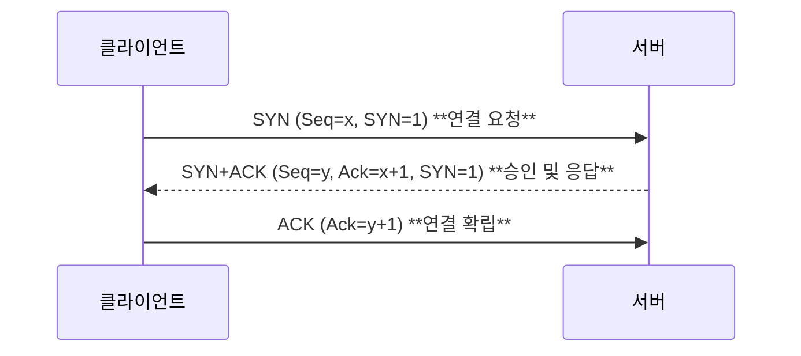

## TCP/IP 스택 및 프로토콜 계층 개요

TCP/IP 모델은 인터넷에서 표준적으로 사용되는 네트워크 프로토콜 계층 구조로, OSI 7계층 모델을 단순화하여 4계층 또는 5계층 구조로 설명됩니다.
상위 계층 프로토콜은 하위 계층의 기능에 의존하고, 하위 계층은 상위 계층에 서비스를 제공하는 계층화된 설계를 취합니다. 
예를 들어, 웹의 HTTP 프로토콜은 아래의 TCP (전송 계층)와 IP (인터넷 계층)를 통해 동작합니다.

이 TCP/IP 계층 구조에서 **데이터 캡슐화(encapsulation)**란, 각 계층에서 상위 계층 데이터에 해당 계층의 헤더(Header) 정보를 추가하여 하위 계층으로 전달하는 과정이고,
**역캡슐화(decapsulation)**란 수신 측에서 하위 계층 헤더들을 역순으로 제거하며 상위 계층에 데이터를 인계하는 과정입니다.
이를 통해 데이터는 송신 측에서 계층을 내려갈 때 점점 큰 **캡슐(헤더가 붙은 데이터 단위)**로 포장되었다가, 수신 측에서 계층을 올라가며 원래의 데이터로 복원됩니다.


[그림1. TCP/IP Model]

| 계층 (TCP/IP 모델)                    | PDU 명칭                          | 주요 예시 프로토콜            |
| --------------------------------- | ------------------------------- | --------------------- |
| **응용 계층** (Application)           | **메시지**                            | HTTP, FTP, SMTP 등     |
| **전송 계층** (Transport)             | **세그먼트** (TCP), **데이터그램** (UDP) | TCP, UDP              |
| **인터넷 계층** (Network)              | **패킷**                             | IP (IPv4/IPv6)        |
| **네트워크 인터페이스 계층** (Link)          | **프레임** (Frame)                 | 이더넷, Wi-Fi (MAC 계층) 등 |
| *(물리 계층은 TCP/IP 모델에서 링크 계층에 포함됨)* | **비트 스트림**                   | (케이블 신호, 전파 등)        |

데이터가 전송될 때 캡슐화 과정을 거치므로, 예를 들어 웹 브라우저가 생성한 HTTP 메시지는 전송 계층(TCP)에서 세그먼트로 쪼개지고 TCP 헤더가 붙은 TCP 세그먼트가 됩니다.
그런 다음 인터넷 계층(IP)에서 IP 헤더가 추가되어 IP 패킷이 되고, 마지막으로 링크 계층에서 프레임 헤더와 트레일러가 붙은 이더넷 프레임으로 캡슐화되어 물리 매체로 전송됩니다.
수신 측에서는 이 과정을 역으로 수행하여 링크 계층에서 프레임을 수신하고 헤더 제거 후 IP 패킷 추출, 이어서 TCP 세그먼트를 얻고 최종적으로 원본 응용 계층 데이터(메시지)를 재조립합니다.


[그림2. TCP Header Format]

TCP/IP 캡슐화: 상위 계층의 데이터에 계층별 헤더(및 필요시 트레일러)를 추가하면서 하위 계층으로 내려보내는 과정.
물리 계층에서는 최종적으로 비트 신호로 변환되어 전송된다.

### 데이터 송신 및 수신 워크플로우 (3-way-handshake)
송신 측 호스트에서 데이터를 전송할 때는 응용 프로그램이 소켓 API 등의 인터페이스를 통해 전송 요청을 합니다. 예를 들어 웹 브라우저가 HTTP 요청을 보낼 때, HTTP 메시지가 운영체제의 TCP 계층으로 전달됩니다. 
**전송 계층(TCP)**은 이 데이터를 적절한 크기로 **세그먼트(segment)**로 분할(세그멘테이션)하고, 각 세그먼트에 송신 포트, 수신 포트, 순서 번호(Sequence Number) 등 TCP 헤더 정보를 추가합니다
. 이렇게 생성된 TCP 세그먼트는 **인터넷 계층(IP)**으로 넘어가 IP 헤더가 추가됨으로써 **IP 패킷(datagram)**이 되며, 여기에는 발신지와 목적지 IP 주소 등의 정보가 포함됩니다. 이어서 **네트워크 인터페이스 계층(링크 계층)**에서는 
해당 IP 패킷에 링크 계층의 헤더(예: 이더넷 MAC 주소)와 트레일러(예: FCS 체크섬)를 붙여 **프레임(frame)**을 구성합니다. 
이 프레임은 물리 계층에서 전기/광학 신호(비트 스트림)로 변환되어 네트워크 매체를 통해 송신됩니다.

송신되는 각 **TCP 세그먼트에는 순서 번호(Sequence Number)**가 부여되는데, 이것은 해당 세그먼트에 실린 첫 번째 바이트의 일련 번호를 나타냅니다.
TCP는 바이트 스트림의 모든 바이트에 순차 번호를 매겨두고, 세그먼트를 나눌 때 그 세그먼트의 첫 바이트 번호를 순서 번호로 사용합니다. 예를 들어, 데이터 스트림의 
첫 바이트가 순서번호 0이라면 MSS(Maximum Segment Size) 크기에 따라 첫 번째 세그먼트 순서번호=0, 두 번째 세그먼트 순서번호=1000, 세 번째 세그먼트=2000과 같이 부여됩니다.
한편 각 TCP 연결에서 **초기 순서 번호(ISN)**는 양측 호스트가 무작위로 선택하는데, 이는 과거에 전송된 세그먼트와 혼동을 방지하고 보안을 강화하기 위함입니다.


[그림3. 송신측(Layer Encapsulation) 수신측 (Layer Decapsulation)]

```
출처: http://networking.layer-x.com/p040200-1.html
```


### 수신 측 흐름

수신 측 호스트의 데이터 수신 과정은 위 송신 절차의 역순으로 진행됩니다 (역캡슐화). 물리 계층에서 수신된 신호는 비트열로 복원되고, 링크 계층에서는 이 비트를 모아 프레임으로 조립한 후 프레임 헤더를 확인합니다. 
수신된 프레임의 MAC 주소 등이 자신의 것이라면, 링크 계층은 프레임의 헤더와 트레일러를 제거하고 상위 IP 패킷을 추출합니다. **인터넷 계층(IP)**에서는 IP 헤더를 검사하여 목적지 IP 주소가 자신의 주소인지 확인한 뒤, 
IP 헤더를 제거하고 TCP 세그먼트를 상위 계층에 전달합니다. (만약 IP 패킷이 여러 조각으로 **단편화(fragmentation)**되어 온 경우라면 이 단계에서 조각들을 모아 재조립한 후 상위에 전달합니다. 자세한 내용은 아래 MTU 단편화 부분 참조.)

**전송 계층(TCP)**에 도달한 세그먼트는 TCP 헤더의 포트 번호를 확인하여 어떤 애플리케이션 소켓으로 보내야 할지 결정됩니다. 그 다음 수신 측 TCP는 세그먼트의 순서 번호를 점검하여 해당 세그먼트가 기대한 순서의 데이터인지를 확인합니다. TCP는 수신한 데이터를 애플리케이션에 순서대로 인도해야 하므로, 
만약 세그먼트가 정상적인 순서(예상된 순서 번호)로 도착했다면 일단 수신 버퍼에 저장한 후 상위 응용 계층으로 전달하거나, 바로 이전에 도착한 데이터와 연계하여 애플리케이션으로 보냅니다. 반면 순서가 뒤바뀐(out-of-order) 세그먼트가 도착한 경우 수신자는 두 가지 전략 중 하나를 택할 수 있습니다
: (1) 순서가 어긋난 세그먼트를 즉시 버리고 향후 재전송을 기다리거나, 
  (2) 세그먼트를 일단 버퍼링해 두고 빠진 부분의 세그먼트를 기다리는 것입니다. 
실제 TCP 구현체들은 일반적으로 효율을 위해 후자를 택하여, 도착한 out-of-order 세그먼트를 버퍼에 저장해 두고 다음 결속되는 데이터가 올 때까지 대기합니다.

수신 측은 데이터가 정상 수신되었음을 알리는 **확인 응답(ACK)**을 송신 측으로 보내줍니다. TCP 세그먼트 헤더의 확인 응답 번호(Acknowledgment Number) 필드는 다음에 수신하고자 하는 바이트의 순서 번호를 담는데, 이는 곧 “지금까지 (연속적으로) 잘 받은 바이트의 마지막 번호 + 1”을 의미합니다.
예를 들어 호스트 B로부터 0번부터 535번까지의 바이트를 모두 받은 호스트 A는 다음에 536번 바이트를 기대하므로 ACK 번호=536을 응답합니다.
TCP는 누적 ACK 방식을 사용하여 연속된 데이터에 대해서만 ACK 번호를 증가시키며, 중간에 손실된 바이트가 있다면 그 부분부터는 아직 수신되지 않았음을 나타내는 ACK 번호를 유지합니다.
예를 들어 0~535 바이트를 받은 후 536~899 바이트가 누락되고 900~1000 바이트를 받아도, 호스트 A는 “여전히 536번 바이트를 기다린다”는 의미로 ACK=536을 계속 보내고 누락된 부분이 도착하지 않았음을 알립니다.
이런 ACK는 이전과 동일한 번호로 여러 번 보내지므로 송신 측에서는 중복 ACK를 감지하게 되고, 이는 해당 구간에 패킷 손실이 발생했음을 알려주는 신호가 됩니다 (이 동작은 아래 혼잡 제어에서 설명하는 빠른 재전송 메커니즘과 연관됩니다).

또한 수신 측 ACK에는 자신의 수신 버퍼 여유 공간을 바이트 단위로 알려주는 윈도우 크기(window size) 필드가 포함됩니다. 송신 측은 이 윈도우 크기 정보(rwnd, 수신 윈도우)를 바탕으로 한 번에 보낼 수 있는 데이터 양을 조절합니다.
예를 들어 수신 버퍼가 100바이트까지 여유가 있다고 광고하면 송신 측은 ACK에 명시된 윈도우 값 내에서만 세그먼트를 보내고, 그 이상은 ACK 응답으로 버퍼 여유가 늘어날 때까지 대기합니다. 이를 통해 수신 측 버퍼 오버플로우를 방지하여 흐름을 제어할 수 있습니다.

일반적인 https 프로토콜로 통신하는 경우, TLS-Handshake(4-way-handshake)를 수행합니다. 이는 종단간 연결을 암호화한 데이터로 네트워크 구간을 보하히기 위한 비대칭 키 교환 과정과 암호화, 복호화 과정이 포함되어 단계가 늘어납니다.


[그림4. 3-way handshake]

### 슬라이딩 윈도우 프로토콜: 흐름 제어와 버퍼 관리
TCP는 **슬라이딩 윈도우(sliding window)**라는 메커니즘을 사용하여 **흐름 제어(flow control)**를 구현하고, 효율적인 버퍼 관리를 수행합니다. 
슬라이딩 윈도우란 한쪽에서 일정 범위 내의 데이터를 연속적으로 보내고, 다른 쪽에서는 그 범위 내에서 수신 및 ACK을 주고받으며 창(window)을 한 칸씩 슬라이딩(이동)시키는 방식입니다.
이를 통해 매 패킷마다 ACK을 기다리느라 링크가 놀지 않게 파이프라인 전송을 가능케 하고, 동시에 수신 측이 처리 가능한 양 이상의 데이터를 보내지 않도록 제어합니다.

**윈도우 크기(window size)**는 송신자가 한 번에 보낼 수 있는 미확인(unacknowledged) 데이터의 총량을 가리키며, 수신 측의 수신 버퍼 크기와 현재 버퍼에 쌓인 데이터 양에 따라 결정됩니다.
수신 측은 자신의 여유 버퍼 공간을 윈도우 크기로 계산하여 ACK의 윈도우 필드에 광고(advertise)하고,
송신 측은 이를 수신하여 **송신 윈도우(send window)**를 설정합니다. 송신 윈도우는 송신자가 ACK을 받지 않은 상태로 보낼 수 있는 최대 바이트 수를 나타내며, 일반적으로 송신 버퍼 크기와 수신자가 광고한 윈도우 크기(rwnd) 중 작은 값으로 결정됩니다
(여기에 혼잡 제어에 따른 혼잡 윈도우(cwnd) 제한도 적용되어, 실제 송신 가능한 양은 min(rwnd, cwnd)로 결정됩니다).

> 전송은 되었으나, ACK을 받지 못한 Byte 크기를 파악하기 위해 사용합니다.
>
> LastByteSent - LastByteAcked ≤ ReceiveWindowAdvertised
> 마지막에 보낸 바이트 수 - 마지막에 확인된 바이트 수 ≤ 남은 버퍼 공간

TCP/IP를 사용하는 모든 호스트들은 송신 그리고 수신을 위해 2개의 Windows를 가지고 있습니다. 호스트들은 실제 데이터를
보내기 전에 3-way handshake를 통해 연결을 할 때 수신측의 수신 윈도우 크기에 맞춰 송신 윈도우 크기를 맞춰 설정합니다.

1. 송신 버퍼

- 200 이전 바이트는 전송 성공했고, 확인 응답을 받은 상태
- 그런데 200 ~ 202 바이트는 아직 확인 응답을 받지 못한 상태
- 203 ~ 211 바이트는 아직 전송이 되지 않은 상태

2. 수신 윈도우


3. 송신 윈도우

- 수신 윈도우보다 작거나 같은 크기로 송신 윈도우를 지정하여 흐름제어

4. 송신 윈도우 슬라이딩(이동)

- Befor 에서 203 ~ 204를 전송하면 수신측에서는 확인응답 203을 보내고, 송신측은 이를 받아 After 상태와 같이 송신 윈도우를
  203 ~ 209로 이동함.
- Afte는 205 ~ 209가 전송 가능한 상태

수신 측에서는 순서대로 수신된 바이트들을 수신 버퍼에 저장하고 응용 계층에 전달합니다. 수신 버퍼에 쌓여 있는 양이 늘어나면 광고하는 윈도우 크기가 줄어들고, 버퍼의 데이터를 애플리케이션이 읽어 처리하면 여유 공간이 늘어나 다시 윈도우를 키워 ACK에 반영합니다.
만약 수신 애플리케이션이 매우 느려서 버퍼가 꽉 차게 되면 수신 측은 윈도우 크기 0을 광고하여 송신 측이 일시적으로 전송을 멈추도록 합니다. 이런 상태에서는 수신 측이 버퍼를 비운 후 윈도우 크기를 늘려주는 윈도우 업데이트(window update) ACK을 송신하여 통신을 재개합니다.

애플리케이션이 버퍼를 읽어들이는 속도가 네트워크에서 수신받아 버퍼를 채우는 속도보다 느릴 경우의 예시동작을 살펴보겠습니다.
> 전제: 송신자는 이미 데이터를 보내고 있고(파일 전송 등), 수신측 애플리케이션이 버퍼를 천천히 읽거나 잠깐 멈춰서서 커널의
> 수신 버퍼가 점점 채워지는 상황

동작 흐름 
1. **초기 상태 - 데이터가 들어오기 시작**
   - 네트워크에서 패킷(데이터 세그먼트)이 계속 도착하고 커널은 이를 수신 버퍼(소켓 rcvbuf)에 쌓습니다.
   - 커널은 각 수신 패킷에 대해 ACK를 송신자에게 보내고, 그 ACK에는 현재 광고(Advertised) 수신 윈도우(rcv_wnd)값을
     포함합니다. (광고 윈도우 = 수신 버퍼의 여유 공간, tcp_select_window()에서 결정되는 값)

2. **버퍼 점유율 증가 -> 광고 윈도우 감소**
   - 애플리케이션이 데이터를 느리게 읽으면 rcvbuf의 사용량이 증가해 남은 여유가 줄고, 커널이 다음 ACK에 실어 보내는
      rcv_wnd 값이 작아집니다.
   - 송신측은 실제로 보낼 수 있는 양을 min(상대가 광고한 rcv_wnd, 혼잡 윈도우 cnwd)로 계산하므로, 광고 윈도우가
     작아지면 송신량은 거기에 맞춰 제한됩니다.

3. **버퍼가 점점 작아져서 결국 0이 됨 (zero window)**
   - 만약 애플리케이션이 전혀 읽지 않거나 읽는 속도가 매우 느려서 여유 공간이 0이 되면, 커널은 ACK의 window 필드에
     0을 광고합니다. 이것이 zero window 상태입니다.
   - 이 순간부터 송신측은 rcv_wnd = 0 때문에 새로운(추가) 데이터를 보낼 수 없습니다. 단, 이미 in-flight로 송신된
     데이터(수신자가 ACK하지 않은 데이터)는 여전히 존재할 수 있습니다.

4. **송신측의 즉각적인 반응 - 전송 중단(데이터 전송 유예)**
   - 송신 TCP 스택은 새로운 데이터 전송을 중단합니다.(단, 이미 전송된 미확인 데이터는 재전송 로직에 따름). cwnd가
     크더라도 rwnd가 0이면 실제 전송은 멈춥니다.

5. **윈도우가 다시 열릴 때까지 대기와 프로브(Zero-Window Probe)**
   - 수신 애플리케이션이 버퍼를 비우면(데이터를 읽으면) 커널은 다음에 보낼 ACK에 증가된 rcv_wnd를 넣어 송신자에게
     보냅니다. 그러면 송신자는 다시 전송을 재개합니다.
   - 그러나 많은 경우 수신측이 한동안 rcv_wnd = 0 상태를 유지하면 송신자는 주기적으로 "윈도우 프로브"를 보냅니다.
     (zero-window probe). 프로브의 목적은 "상대 윈도우가 여전히 0인지, 아니면 열렸는지"를 확인하기 위함입니다.
     보통 프로브는 아주 작은 페이로드(예: 1바이트)나 빈 세그먼트로 전송되어 응답(ACK/윈도우 업데이트)을 유도합니다.
     (in Linux: tcp_send_window_probe())

6. **프로브에 대한 응답** - 윈도우가 열리면 전송 재개
   - 수신측이 그 사이에 버퍼를 비웠다면 프로브/혹은 일반 ACK에 새로운 큰 rcv_wnd 값이 포함되어 들어오고, 송신자는
     즉지 전송을 재개합니다.
   - 만약 계속 0ㅇ면 송신자는 주기적으로(지수적으로 혹은 고정 인터벌) 프로브를 반복합니다. 이 주기는 구현/설정에 따라
     다르며, 연결 유지 정책(RTO/keepalive)과도 상호작용합니다.

7. **혼잡 제어와 결합** - cwnd와 rwnd의 상호작용
   - 핵심: 송신 가능한 총량은 항상 min(cwnd, rwnd) 이므로, rwnd가 줄어들면 네트워크 혼잡 여부와 상관 없이
     송신이 제한됩니다. 즉, 수신측의 느린 소비가 송신 흐름을 직접 멈추게 합니다. (flow-control)
   - 혼잡제어(cwnd)는 별개로 RTT/손실을 기반해 동작하므로, rwnd가 0인 상태가 장기화 되면 네트워크 상의 혼잡신호
     와도 결합되어 전반적인 throughput에 영향을 줍니다.

8. **수신 버퍼 자동 튜닝(autotuning)의 역할**
   - 현대 리눅스는 tcp_moderate_rcvbuf 같은 자동 튜닝 로직으로 수신 버퍼 상한을 동적으로 조절합니다. 하지만
     애플리케이션이 전혀 읽지 않으면 튜닝으로도 해결되지 않고 결국 rwnd는 0이 됩니다.

9. **장시간 rwnd=0** 이슈 - 타임아웃/연결 끊길 가능성
    - 긴 시간 동안 데이터 소비가 진행되지 않으면 송신 측은 프로브에도 응답이 없을 때 재전송 타임아웃(RTO), TCP
      keepalive(설정되어 있으면) 또는 상위 애플리케이션 타임아웃에 따라 연결을 닫을 수 있습니다.
      

**TCP 슬라이딩 윈도우**: 송신자는 설정된 윈도우 크기 내에서 여러 세그먼트를 연속으로 보낸다. 수신자가 ACK으로 확인하면 윈도우가 그 만큼 전진하여 다음 세그먼트를 전송할 수 있게 된다.
위 그림에서 Sender는 두 세그먼트를 보내고 ACK을 받아 윈도우를 슬라이딩하면서 연속적인 데이터 전송을 수행한다.


[그림5. 슬라이딩 윈도우]

예시: Sender가 1000바이트 크기의 윈도우를 갖고 있어 첫 두 세그먼트(Seq=1, Seq=1001)를 연달아 보냅니다. Receiver는 첫 번째 세그먼트를 받고 ACK 1001을 응답하여 다음에 1001번 바이트를 기다린다는 것을 알립니다. 
Sender는 ACK를 수신하자 윈도우를 앞으로 1000바이트 슬라이딩하여 세 번째 세그먼트(Seq=2001)를 전송합니다. 이어 Receiver가 ACK 2001을 보내면 Sender는 윈도우를 또 전진시켜 다음 데이터를 보낼 수 있게 됩니다. 
이러한 방식으로 TCP는 여러 세그먼트를 파이프라인으로 전송하며, ACK에 따라 동적으로 윈도우를 이동시켜 효율을 높입니다.


슬라이딩 윈도우를 통한 흐름 제어 덕분에, 송신 측은 항상 수신 측이 처리 가능하고 버퍼에 수용 가능한 만큼만 데이터를 보내게 됩니다.
또한 윈도우 크기는 네트워크 상태나 수신 처리속도에 따라 동적으로 변화하므로, 네트워크 혼잡이나 수신 앱 성능 저하 등에도 적응할 수 있습니다.
다만 윈도우 크기의 기본 최대값은 TCP 헤더에 16비트 필드로 저장되어 있어 65,535바이트이지만, 현대 TCP에서는 **윈도우 크기 확장 옵션(Window Scale)**을 통해 더 큰 윈도우(고속/지연 네트워크에서 필요)를 지원합니다.

### 순서 번호와 확인 응답 번호: 신뢰성의 핵심

TCP가 신뢰적인 전송을 제공하는 핵심에는 **순서 번호(Sequence Number)**와 확인 응답 번호(ACK Number) 체계가 있습니다. 이 번호들은 앞서 설명한 대로 송신되는 바이트 스트림의 위치를 지정하고 수신 상태를 피드백하여 패킷의 누락이나 중복, 순서 뒤바뀜을 탐지할 수 있게 합니다.

순서 번호는 TCP 세그먼트 헤더에 32비트로 존재하며, 각 세그먼트의 첫 번째 바이트의 번호를 나타냅니다.
TCP 연결을 설정할 때 클라이언트와 서버는 각각 임의의 Initial Sequence Number(ISN)를 선택하여 세션을 시작하며, 이후 전송되는 데이터 바이트들에 순차적으로 번호가 매겨집니다.
이 순서 번호를 통해 수신 측은 받은 세그먼트가 데이터 스트림 내 어느 위치에 해당하는지 알고, 원래 데이터 순서를 재구성할 수 있습니다. 또한 중복된 세그먼트가 도착했을 때 동일한 순번을 
가지므로 중복 여부를 인지하여 버릴 수 있고, 손실된 세그먼트는 순서의 **공백(gap)**으로 감지할 수 있습니다.

**확인 응답 번호(ACK)**는 수신 측이 TCP 세그먼트를 받았을 때 송신 측에 회신하는 번호로, 다음에 수신하기를 기대하는 순서 번호를 의미합니다.
예를 들어, 수신 측이 순서번호 0부터 999까지의 데이터를 모두 받았다면 다음 기대 바이트는 1000이므로 ACK=1000을 송신 측에 보냅니다. 이 ACK 누mern은 누적 ACK 방식으로 동작하여, 
중간에 빠진 데이터가 없다면 계속 증가하지만 한 바이트라도 결손이 생기면 그 지점 이후는 받지 못했다는 신호로 더 이상 증가하지 않습니다.
수신 측은 받은 세그먼트의 순서 번호 + 길이를 기반으로 ACK 번호를 계산하며, 만약 세그먼트가 연속적이지 않다면 마지막 연속 바이트까지만 ACK하게 됩니다.
이러한 설계로 송신 측은 ACK 번호의 정체 또는 중복 ACK들을 통해 특정 세그먼트 이후 데이터가 도착하지 않았음을 인지하게 됩니다.


TCP는 타이머 기반 재전송과 중복 ACK 기반 빠른 재전송을 모두 활용하여 신뢰성을 담보합니다. 송신 측에서 세그먼트를 보내면 해당 세그먼트에 대한 ACK이 일정 시간(RTO, 재전송 타임아웃) 내에 돌아오지 않을 경우 해당 세그먼트를 타임아웃 재전송합니다.
이는 패킷 손실이나 네트워크 문제로 인한 ACK 손실을 다루는 기본 메커니즘입니다. 한편, 더 빠른 손실 탐지를 위해 중복 ACK도 활용됩니다. 수신 측이 일정 범위의 데이터 이후를 계속 기다리는 상황(예: 세그먼트 손실로 인해 ACK 번호가 계속 동일함)이 발생하면 동일한 ACK 번호가 연속으로 여러 번 송신 측에 도착하게 됩니다. 
TCP에서는 연속 세 번의 중복 ACK를 받으면 해당 ACK 번호 이후의 세그먼트가 손실된 것으로 간주하고, 타이머 만료를 기다리지 않고 즉시 해당 세그먼트를 **빠르게 재전송(Fast Retransmit)**합니다. 이러한 재전송 후에는 혼잡 상황에 대비해 송신 윈도우를 조정하는데, 자세한 내용은 아래 혼잡 제어 부분에서 설명합니다.

요약하면, 순서 번호와 ACK 번호 체계는 TCP가 데이터의 순서 보존과 누락 복구를 구현하는 기반입니다. 순서 번호로 각 세그먼트를 식별하고 ACK으로 수신 여부를 피드백함으로써, TCP는 상위 응용에 신뢰성 있는 바이트 스트림 서비스를 제공합니다.

### 실제 시나리오: 웹 페이지 접속 과정

TCP/IP의 동작을 종합적으로 이해하기 위해, 웹 페이지를 여는 상황을 예로 들어 전체 흐름을 단계별로 살펴보겠습니다:

1. **DNS 이름 해석**: 사용자가 브라우저에 http://www.example.com과 같은 URL을 입력하면, 브라우저는 먼저 도메인 이름(www.example.com)을 IP 주소로 변환해야 합니다. 
호스트는 DNS 클라이언트로서 로컬 DNS 해석기를 통해 설정된 DNS 서버에 쿼리를 보냅니다. 이 DNS 요청은 보통 UDP 프로토콜을 통해 53번 포트로 전송되며, DNS 서버는 해당 도메인의 IP 주소를 응답으로 돌려줍니다 (예: 93.184.216.34). 
이렇게 DNS 조회를 거쳐 웹 서버의 IP 주소를 획득합니다.

2. **TCP 3-way handshake**: 이제 브라우저는 목적지 웹 서버(93.184.216.34)의 80번 포트(HTTP 기본 포트)로 TCP 연결 설정을 시작합니다. 이 과정에서 **클라이언트(브라우저)**는 서버로 SYN 패킷을 보내고 (연결 요청, 초기 순서번호 x 포함)
, 서버는 이를 수신하면 자기 초기 순서번호 y와 함께 SYN+ACK 패킷으로 응답합니다 (SYN 응답 및 클라이언트 순번 x+1에 대한 ACK).
마지막으로 클라이언트가 서버의 순번 y+1을 ACK하는 ACK 패킷을 보내면 연결이 맺어집니다.
이 3단계 핸드셰이크를 통해 양측은 초깃값(순서번호 등)을 교환하고 논리적인 연결을 수립하여 이후에 데이터 전송을 위한 준비를 마칩니다.




[TCP 3-way Handshake: 위 다이어그램은 클라이언트와 서버 간 TCP 핸드셰이크를 보여줍니다.] 

클라이언트가 SYN을 보내면 서버는 SYN+ACK으로 응답하고, 클라이언트가 최종 ACK을 보냄으로써 연결이 확립됩니다.
이 절차 후 TCP 연결이 열리고, 양측은 ISN(Initial Sequence Number) 교환을 통해 신뢰성 있는 전송을 시작할 준비를 합니다.

3. **HTTP 요청 전송**: TCP 연결이 열리면, 브라우저는 HTTP 프로토콜을 통해 웹 서버에 페이지 요청을 보냅니다. 
예를 들어 HTTP GET /index.html 요청 메시지가 생성되어 TCP를 통해 서버로 전송됩니다. 이 HTTP 요청 메시지는 응용 계층 데이터이므로, 
TCP 세그먼트로 캡슐화되어 앞서 설정된 연결을 통해 전달됩니다. 실제로는 브라우저가 소켓 API로 send() 호출을 하여 HTTP GET 문자열을 TCP 스트림으로 흘려보내면, 
운영체제 TCP 스택이 이를 하나 또는 복수의 세그먼트로 나누어 전송합니다. 이 과정에서 슬라이딩 윈도우 및 흐름 제어가 적용되어, 연결 초기에는 작은 윈도우로 시작해 ACK를 주고받으며 데이터 전송이 이루어집니다 (자세한 메커니즘은 앞서 설명한 바와 같습니다).

4. **HTTP 응답 수신**: 서버는 클라이언트로부터 HTTP 요청을 받으면 해당 자원(/index.html)을 처리하여 HTTP 응답 메시지(예: 상태코드 200과 HTML 콘텐츠)를 생성합니다. 이 응답도 TCP 세그먼트들로 나뉘어 클라이언트에게 전송됩니다. 응답 데이터가 크다면 여러 
세그먼트로 분할되어 전송되며, 클라이언트는 이를 순서대로 수신하여 TCP를 통해 reassembly하고 최종 HTTP 응답을 얻습니다. 브라우저는 응답의 HTML 데이터를 렌더링하여 사용자가 웹 페이지를 볼 수 있게 합니다. 이 과정에서도 TCP는 지속적으로 ACK을 주고받으며 
패킷 손실이나 순서 오류가 발생하면 자동으로 재전송하고 흐름을 제어합니다. 예를 들어 어떤 세그먼트가 손실되면 클라이언트는 중복 ACK를 보내거나 타임아웃을 통해 재요청하고, 서버는 해당 세그먼트를 재전송하여 결국 모든 데이터가 도착하도록 합니다.

5. **연결 종료(4-웨이 핸드셰이크)**: 필요한 데이터 교환이 모두 끝나면 클라이언트와 서버는 TCP 연결을 종료합니다. 일반적으로 HTTP/1.1에서는 연결을 재사용하기도 하지만, HTTP/1.0이나 명시적인 종료의 경우 FIN 플래그를 사용하는 4-way handshake로 연결을 해제합니다. 
한쪽(예: 클라이언트)이 FIN 세그먼트를 보내 연결 종료 의사를 표시하면, 상대가 ACK으로 응답하고, 다시 상대측도 FIN을 보내고 이에 ACK를 답하면서 총 4개의 패킷으로 연결이 완전히 닫힙니다.
이렇게 함으로써 양측의 리소스(소켓 등)가 해제되고 통신이 종료됩니다.

### 엣지 케이스와 오류 상황 정리
네트워크 환경에서는 다양한 예외적 상황들이 발생할 수 있으며, TCP/IP는 이를 다루는 메커니즘을 갖추고 있습니다. 
대표적인 엣지 케이스로 MTU 초과로 인한 IP 단편화, 패킷 손실 및 재전송, 패킷의 순서 뒤바뀜 세 가지를 살펴보겠습니다.

### MTU 단편화 (Fragmentation

네트워크 **MTU(Maximum Transmission Unit)**는 링크 계층 프레임에 실을 수 있는 최대 페이로드 크기를 의미합니다. 
전송하려는 IP 패킷 크기가 경로상의 어느 링크 MTU를 초과하면, IP 계층에서 **패킷 단편화(fragmentation)**가 발생합니다.
IPv4의 경우 라우터가 패킷을 여러 조각으로 쪼개어 보낼 수 있으며, 각 조각에는 원본 패킷을 재조립하기 위한 **식별자(ID)**와 조각 오프셋(offset), 
MF(More Fragments) 플래그 등의 정보가 IP 헤더에 포함됩니다.
수신 측 호스트는 모든 조각을 받아 원래의 패킷으로 **재조합(reassembly)**하게 됩니다.
예를 들어 3000바이트짜리 IP 패킷이 MTU 1500바이트인 경로를 지나야 하면, 약 1480바이트씩 데이터를 나눈 두 개의 조각으로 쪼개져 전송되고, 
수신 측에서 이를 합쳐 3000바이트 페이로드를 복원합니다.

이에 대한 자세한내용은 [MSS vs MTU](https://syslians.github.io/posts/MSS,MTU/)에서 다루었습니다.


[그림6. IP 단편화 예시: 원본 PDU(예: 4000바이트 데이터 + 20바이트 헤더)가 MTU 제한으로 인해 3개의 조각으로 분할되었다. 각 조각은 자체 IP 헤더를 가지며 더 작은 데이터 부분을 포함한다]

IPv6의 경우 라우터 단편화가 허용되지 않으며, 송신 측에서 패킷 크기를 미리 조절하도록 요구합니다.
이를 위해 **경로 MTU 탐색(Path MTU Discovery)**을 수행하여 경로상의 최소 MTU에 맞춰 패킷 크기를 결정합니다. 
단편화는 추가적인 헤더 부하와 지연을 초래하고 조각 중 하나만 유실되어도 전체 패킷 손실로 간주되는 등의 문제가 있기 때문에, 
현대의 TCP/IP 구현에서는 가능한 단편화를 회피하는 방향으로 동작합니다 (IPv4에서도 DF 플래그를 설정해 단편화를 금지하고, MTU 탐색으로 처리).

### 패킷 손실과 재전송
네트워크 혼잡이나 오류로 **패킷 손실(packet loss)**이 발생하는 것은 인터넷에서 흔한 상황입니다. TCP는 패킷 손실을 탐지하고 재전송하는 메커니즘을 갖춰 신뢰성을 보장합니다.
가장 기본은 재전송 타이머(RTO) 기반의 재전송으로, 송신한 세그먼트에 대한 ACK이 일정 시간 내 도착하지 않으면 해당 세그먼트를 타임아웃으로 판단하여 재전송합니다.
TCP는 왕복시간(RTT) 측정을 바탕으로 동적으로 RTO를 계산하므로, 네트워크 상태에 따라 타이머가 조정됩니다.

더 발전된 방법으로 중복 ACK을 이용한 **빠른 재전송(Fast Retransmit)**이 있습니다. 수신 측에서 동일한 ACK 번호를 연속 세 번 이상 보내오면 (즉, 세그먼트 하나가 손실되었음을 강하게 시사함) 
송신 측은 타이머 만료를 기다리지 않고 해당 순번 이후 데이터를 즉시 재전송합니다.
예를 들어, 순서번호 1001 세그먼트가 손실되어 수신 측이 ACK 1001을 세 번 보내왔다면, 송신 측은 1001 세그먼트를 바로 재전송하게 됩니다. 이렇게 함으로써 패킷 손실로 인한 대기 시간을 크게 줄여 전송 효율을 높입니다.
재전송이 발생하면 혼잡 제어 알고리즘에 따라 송신 윈도우(혼잡 윈도우) 크기를 줄이는 등의 조치를 취하게 되는데, 이는 다음 절에서 다루겠습니다.

### 순서 뒤바뀜 수신 (Out-of-order delivery)
인터넷 라우팅은 동적이므로, 패킷이 전송된 순서와 다른 순서로 도착하는 경우가 생길 수 있습니다. 예를 들어 세그먼트 1, 2, 3을 보냈는데 1과 3만 도착하고 2는 지연되거나 손실된 상황을 생각해봅시다. 
이런 순서 뒤바뀜(out-of-order) 상황에서 수신 측 TCP는 앞서 설명한 대로 일단 순서가 어긋난 세그먼트를 버퍼링하고 빠진 세그먼트를 기다립니다.
동시에 가장 마지막에 연속적으로 수신한 바이트까지의 ACK를 송신 측에 보냅니다 (누락 구간이 있다면 그 바로 전까지만 ACK). 위 예시에서는 세그먼트 1의 데이터까지만 수신되었다면 ACK은 그 다음 기대 바이트인 2의 시작 번호를 가리키고, 
세그먼트 3이 도착해도 여전히 세그먼트 2가 비었으므로 동일한 ACK 번호를 반복 전송합니다.
송신 측은 이러한 중복 ACK를 감지하여 세그먼트 2의 손실을 인지하고 빠른 재전송을 수행하게 됩니다.

만약 일시적인 지연으로 세그먼트 2가 늦게 도착한 경우, 수신 측은 버퍼에 보관해둔 세그먼트 3과 함께 순서대로 데이터를 정렬한 뒤 누적 ACK를 진행합니다. TCP의 설계 상 out-of-order 패킷 자체를 수신 측에서 재정렬하여 애플리케이션에 전달하는 일은 없습니다. 
항상 상위로 올리는 것은 순서 정합된 바이트 스트림이며, 순서가 어긋난 데이터는 내부 버퍼에 유지될 뿐 애플리케이션에는 노출되지 않습니다. 이런 처리 덕분에 응용 프로토콜은 TCP 위에서 데이터 순서에 신경 쓸 필요 없이 개발될 수 있습니다. 
(추가로, TCP에는 Selective Acknowledgement (SACK) 옵션이 정의되어 있어 수신 측이 누락되지 않고 받은 범위들을 선택적으로 알려줄 수도 있습니다. SACK을 사용하면 패킷 손실이 많은 환경에서 재전송 효율을 높일 수 있지만, 기본 누적 ACK 동작을 보완하는 선택 사항입니다.)

### 혼잡 제어 알고리즘 (Congestion Control)
TCP는 네트워크 내 **혼잡(Congestion)**으로 인해 발생하는 패킷 손실과 지연을 완화하기 위해 혼잡 제어 알고리즘들을 구현하고 있습니다.
송신 측은 네트워크 상태를 추정하여 송신 속도를 조절함으로써 **혼잡 붕괴(congestion collapse)**를 방지하고 공정한 네트워크 자원 공유를 도모합니다.
혼잡 제어의 핵심 요소는 **혼잡 윈도우(cwnd)**라는 송신 측 윈도우 크기입니다. 혼잡 윈도우는 네트워크 혼잡 상황을 고려하여 동적으로 변화하는 송신 윈도우 한계이며,
수신 윈도우(rwnd)와 함께 실제 송신 가능한 윈도우 크기를 결정합니다. 일반적으로 송신 가능한 바이트 수 = min(rwnd, cwnd)로 계산되며, 두 제약 중 더 엄격한 쪽이 적용됩니다.
TCP는 혼잡 윈도우를 관리하기 위해 몇 가지 단계적 알고리즘을 사용합니다:

- **Slow Start** (느린 시작)
- **Congestion Avoidance** (혼잡 회피)
- **Fast Retransmit (빠른 재전송) 및 Fast Recovery** (빠른 복구)

이들은 초기의 TCP Tahoe/Reno 구현에서 정립된 알고리즘으로, 오늘날에도 TCP 혼잡 제어의 기본으로 작동하고 있습니다
(현대 운영체제에서는 CUBIC, BBR 등 새로운 알고리즘이 쓰이기도 하지만 원리는 유사한 부분이 많습니다).
아래 그림은 느린 시작 단계에서 혼잡 윈도우가 급격히 증가한 뒤 혼잡 회피 단계에서 선형적으로 증가하고,
패킷 손실 발생 시 혼잡 윈도우가 감소하는 혼잡 제어의 전형적인 패턴(TCP의 사톱니(saw-tooth) 그래프)을 보여줍니다:


[그림7. TCP SawTooth 그래프.]

[TCP 혼잡 윈도우 크기 변화 예시. 초기 Slow Start 단계에서는 ACK마다 윈도우가 지수적으로 성장하여 링크 용량을 빠르게 찾아가고, 혼잡 임계점(ssthresh) 도달 후 Congestion Avoidance 단계에서는 선형적인 성장으로 전환된다.
패킷 손실이 발생하면 혼잡 윈도우가 감소(여기서는 약 절반)되어 Fast Recovery를 거쳐 다시 회피 단계로 진입한다.]

### Slow Start
느린 시작은 이름과 달리 초기에 송신 속도를 급격하게 끌어올리는 TCP 혼잡제어 단계입니다. 새로운 TCP 연결이 시작되거나 혼잡 상황 이후 cwnd를 초기값으로 리셋해야 할 때, 송신 측은 네트워크의 용량을 모르기 때문에 일단 매우 낮은 속도로 시작합니다.
일반적으로 cwnd 초기값은 과거에는 1 MSS(최대 세그먼트 크기)이었지만, 현대 TCP 구현에서는 10 MSS 정도로 상향되기도 했습니다.
Slow Start 단계에서는 ACK 하나를 받을 때마다 혼잡 윈도우를 MSS 단위로 +1씩 증가시킵니다.
결과적으로 매 RTT(Round Trip Time)마다 전송 가능한 세그먼트 수가 거의 두 배로(지수적으로) 늘어나게 됩니다.
예를 들어 초기 cwnd=1 MSS라면, 첫 RTT에 1개 보내 ACK 1개 받으면 cwnd=2, 다음 RTT에 2개 보내 ACK 2개 받으면 cwnd=4... 이런 식으로 빠르게 증가합니다.

이러한 지수 증가 정책은 네트워크의 용량을 신속히 탐색하는 장점이 있지만, 아무리 네트워크가 느려도 cwnd가 급격히 커지므로 어느 순간 혼잡 패킷 손실이 발생할 수밖에 없습니다.
이를 완화하기 위해 TCP는 **ssthresh (slow start threshold, 혼잡 임계값)**이라는 경계를 설정합니다. cwnd가 ssthresh에 도달하면 느린 시작 단계를 종료하고 다음 혼잡 회피 단계로 전환합니다.
더 정확하게 Slow Start는 두 배씩 전송을 늘리다가 패킷 드랍에 의한 RTO가 발생하면, 네트워크가 수용 가능한 전송량에 도달했다고
판단하고, ssthresh를 설정하게 됩니다. 

cwnd를 두 배로 늘려서 드랍이 발생했으므로 ssthresh는 두 배를 늘리기 전인 cwnd 값으로
설정하고, cwnd값을 1로 리세시킵니다. 이후 slow start를 다시 시작하는데, cwnd값이 ssthresh값보다 커지게 되면 네트워크 용량에
도달했다고 판단하여 slow start를 종료하고 Congestion avoidance 단계로 넘어갑니다. 위 그림7의 그래프를 참고합니다.

### 혼잡 회피 (Congestion Control)
혼잡 회피 단계에서는 혼잡 윈도우를 점진적으로(linearly) 증가시킵니다.
Reno 계열 알고리즘 구현에서는 매 RTT마다 cwnd를 1 MSS 만큼 증가시키는 식으로, 느린 시작의 지수 증가보다 훨씬 완만한 속도로 송신 윈도우를 키워나갑니다.
이렇게 하면 네트워크에 작은 부하를 추가하면서 서서히 최대 처리량을 찾아가는 효과가 있습니다. 결국 혼잡 회피 단계에서는 cwnd가 선형적으로 상승하여 
혼잡 사인이 나타날 때까지 (보통은 패킷 손실로 감지) 계속됩니다.

혼잡 회피 중에 패킷 손실(또는 RTO 타임아웃)이 발생하면, 이는 네트워크 용량을 초과했음을 의미하므로 TCP는 혼잡 상황으로 간주하여 대응에 들어갑니다.
이때 두 가지 경우로 분기하는데, 타임아웃으로 손실을 감지(RTO)한 경우와 중복 ACK(dup-ACK)로 손실을 감지한 경우가 그것입니다.
타임아웃으로 손실을 감지한 경우 -> Fast Retransmit, 중복 AC로 손실 감지 -> Fast Recovery.

### 혼잡 빠른 재전송 (Fast Retransmit) 와 빠른 복구 (Fast Recovery)
**타임아웃 발생(RTO)**: RTO 타임아웃으로 패킷 손실을 감지하면, TCP는 이를 심각한 혼잡으로 간주합니다.
왜냐하면 손실 난 세그먼트 이후의 세그먼트들에 대한 ACK도 전혀 도착하지 않았다는 뜻이므로 네트워크가 크게 막힌 상황일 수 있습니다.
이 경우 TCP (Reno 기준으로) cwnd를 1 MSS로 초기화하고 혼잡 임계값 ssthresh를 현재 보냈던 양의 절반으로 낮춘 후, 다시 느린 시작 단계로 들어갑니다.
즉, RTO가 일어났을 경우 slow satrt 상태로 들어가며 앞과 동일하게 ssthresh를 cwnd/2로, cwnd를 1로 리셋합니다.
이 방식(TCP Tahoe의 행동)은 혼잡을 완전히 해소하기 위해 송신 속도를 극도로 줄이는 보수적 대응입니다.

**중복 ACK 발생(3-dup ACK)**: 세그먼트 손실을 3개의 중복 ACK으로 감지한 경우 (Fast Retransmit 상황)에는, 네트워크가 부분적으로는 패킷을 전달하고 있다는 뜻이므로 심각度가 덜한 혼잡으로 봅니다.
TCP Reno 알고리즘에서 송신 측은 일단 손실된 세그먼트를 즉시 재전송하고, 혼잡 임계값 ssthresh를 현재 플라이트에 있었던 바이트의 절반으로 줄입니다.
그리고 cwnd를 ssthresh 값까지 감소시킵니다 (대략 기존 cwnd의 1/2 수준).

하지만 여기서 느린 시작으로 돌아가는 대신 Fast Recovery (빠른 복구) 단계로 진입하여, 패킷 손실 이후에도 연결을 완전히 끊지 않고 혼잡 회피 모드로 곧장 전환합니다.
즉 cwnd를 감축한 새 임계값 수준에서 선형 증가를 재개함으로써, 네트워크 혼잡을 완화하면서도 전송량을 너무 급격히 줄여 성능이 떨어지는 것을 방지하는 것입니다.
Fast Recovery 단계에서는 손실이 발생하지 않으면 cwnd를 다시 선형 증가시키며, 만약 또 중복 ACK가 발생하면 같은 절차를 반복합니다. Fast Recovery를 구현한 알고리즘이 TCP Reno이며, 이후의 TCP NewReno 등도 이 개념을 개선하여 사용합니다.

정리하면, 혼잡 제어 알고리즘은 다음과 같이 동작합니다: 새로운 연결이나 혼잡 후에는 느린 시작으로 cwnd를 급격히 키워 가능한 대역폭을 빨리 탐색하고, 일정 임계점 이후에는 혼잡 회피로 완만히 증가시키며 네트워크를 안정적으로 이용합니다.
만약 혼잡 신호(손실)가 나타나면 cwnd를 감소시켜 네트워크 부하를 줄이고, 손실 감지 방식에 따라 느린 시작으로 돌아가거나 빠른 복구로 이어집니다. 이러한 AIMD(Additive Increase, Multiplicative Decrease) 원리에 기반한 혼잡 제어 덕분에 여러 TCP
연결들이 공정하게 네트워크 자원을 나누고, 과도한 패킷 유입으로 인한 혼잡 collapse를 방지할 수 있습니다.
TCP 혼잡 제어는 인터넷 트래픽의 자율적인 견제 장치로 작용하여, 신뢰성뿐 아니라 전체 네트워크의 안정성을 유지하는 데에도 핵심적인 역할을 합니다.

출처: omnisecu, amad-note.tistory, velog, en.wikipedia, witestlab.poly, commons.wikimedia, extrahop
,scapy.readthedocs, howudong.tistory, https://velog.io/@haero_kim, https://ai-com.tistory.com/entry/%EB%84%A4%ED%8A%B8%EC%9B%8C%ED%81%AC-TCP-Congestion-Control-1-%EA%B8%B0%EB%B3%B8-%EC%9B%90%EB%A6%AC
